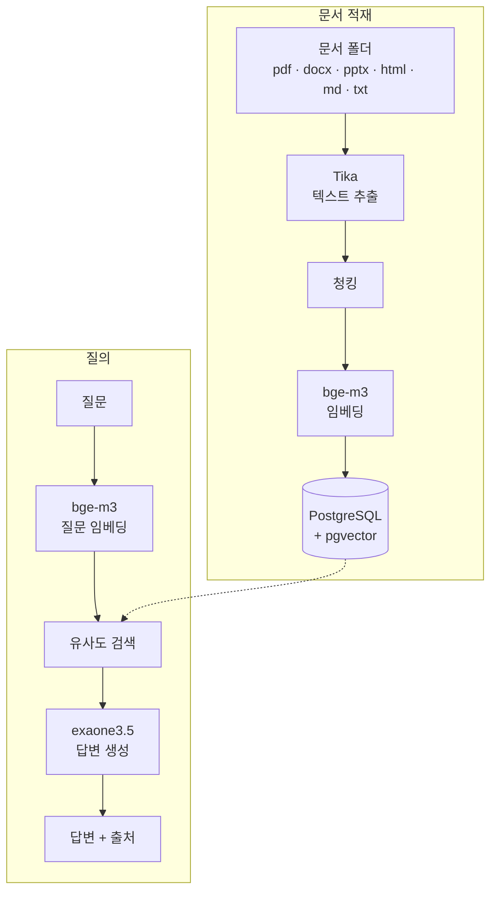

# Rag-Project

로컬 환경에서 동작하는 RAG(Retrieval-Augmented Generation) 시스템을 처음부터 끝까지 직접 구축한 개인 학습 프로젝트입니다.

외부 API나 유료 서비스 없이 **전부 로컬에서 돌아가는 파이프라인**을 목표로 했습니다. 폴더에 문서를 넣으면, 그 문서에 근거해서만 답하고 어느 문서에서 찾았는지 출처까지 보여 주는 질의응답 서비스가 결과물입니다.

> 구현 과정과 개선 내용은 [`dev_docs`](dev_docs/)에 단계별로 정리했습니다. → [1차 구현](dev_docs/1차_구현.md) · [2차 개선](dev_docs/2차_개선.md)

---

## 목차

- [주요 기능](#주요-기능)
- [왜 만들었나](#왜-만들었나)
- [RAG란](#rag란)
- [동작 구조](#동작-구조)
- [기술 스택](#기술-스택)
- [프로젝트 구조](#프로젝트-구조)
- [실행 방법](#실행-방법)
- [개발 기록](#개발-기록)

---

## 주요 기능

- **폴더 단위 문서 적재** — 지정한 폴더의 pdf · docx · pptx · html · md · txt를 한 번에 읽어 벡터 DB에 저장합니다.
- **중복 적재 방지** — 파일 내용의 해시를 비교해 새 파일과 바뀐 파일만 다시 적재합니다.
- **문서 근거 답변** — 검색된 문서 조각만 보고 답하고, 근거가 없으면 "문서에서 찾을 수 없습니다"라고 답합니다.
- **출처 표시** — 답변과 함께 근거가 된 파일명, 유사도 점수, 발췌를 보여 줍니다.
- **질의 화면** — 브라우저에서 질문하고 근거를 하나씩 넘겨 볼 수 있습니다.

---

## 왜 만들었나

현재 SI 회사에서 Java, Spring, 전자정부 표준프레임워크를 사용하는 레거시 프로젝트에 투입되어 있습니다.

LLM을 애플리케이션에 붙이는 일이 늘어나고 있는데, 개념만 알고 직접 만들어본 적은 없었습니다. "RAG가 뭔지 안다"와 "RAG를 만들어봤다"는 다르다고 생각해서, 파이프라인 전체를 직접 엮어보기로 했습니다.

언어를 Java로 정한 것도 의도적입니다. RAG 예제는 대부분 Python(LangChain)으로 되어 있지만, 현재 업무 스택이 Java/Spring이라 **RAG 개념과 실무 스택을 동시에 익히는 쪽**을 택했습니다.

---

## RAG란

LLM은 학습한 시점까지의 지식만 가지고 있고, 내 회사의 내부 문서 같은 건 알지 못합니다. 그렇다고 모르는 걸 모른다고 하지도 않고 그럴듯하게 지어냅니다(할루시네이션).

RAG는 이 문제를 이렇게 해결합니다.

1. 내 문서를 미리 검색 가능한 형태로 저장해둔다
2. 질문이 들어오면 관련 있는 부분을 찾아온다
3. 찾아온 내용을 질문과 함께 LLM에게 주면서 "이것만 보고 답하라"고 시킨다

핵심은 **의미 기반 검색**입니다. 단순 키워드 매칭이 아니라, 텍스트를 벡터(숫자 배열)로 바꾼 뒤 벡터 간 거리를 계산해서 "의미가 비슷한" 문서를 찾습니다. 그래서 "임베딩이 뭔가요"라고 물어도 "임베딩"이라는 단어가 정확히 없는 문장까지 찾아올 수 있습니다.

---

## 동작 구조



모든 단계가 로컬에서 돌아갑니다. 임베딩과 답변 생성은 Ollama가, 벡터 저장과 검색은 Docker로 띄운 PostgreSQL(pgvector)이 맡습니다.

---

## 기술 스택

| 구분        | 사용 기술                                  | 비고                        |
| ----------- | ------------------------------------------ | --------------------------- |
| 언어        | Java (Eclipse Temurin)                     | 25.0.4 LTS                  |
| 프레임워크  | Spring Boot                                | 4.1.1                       |
| AI 통합     | Spring AI                                  | 2.0.1                       |
| 문서 파싱   | Apache Tika (`spring-ai-tika-document-reader`) | pdf · docx · pptx · html 등 |
| 벡터 DB     | PostgreSQL + pgvector                      | `pgvector/pgvector:pg17`    |
| LLM 런타임  | Ollama                                     | 로컬 실행                   |
| 임베딩 모델 | `bge-m3`                                   | 1024차원, 다국어            |
| 답변 모델   | `exaone3.5:2.4b`                           | 연구/비상업 라이선스        |
| 화면        | HTML · CSS · JS                            | 정적 파일 한 장, 빌드 없음  |
| 빌드 / 실행 | Gradle / Docker Desktop (WSL2)             |                             |

### 왜 이 기술인가

- **Java + Spring AI** — 업무 스택이 Java/Spring이라 RAG 개념과 실무 스택을 함께 익히려고 골랐습니다. Spring AI가 Python의 LangChain 역할을 합니다.
- **pgvector** — 별도 서비스 가입이나 API 키 없이, 벡터 검색이 결국 SQL 쿼리라는 걸 직접 확인할 수 있습니다.
- **Ollama (로컬 LLM)** — 비용이 들지 않고, 오프라인으로 동작하며, 문서가 외부로 나가지 않습니다.
- **bge-m3** — 한국어 문서 검색에서 검증된 다국어 임베딩 모델입니다.
- **exaone3.5:2.4b** — 한국어 답변 품질과 응답 속도(7.8b 약 2분 30초 → 약 20초)를 함께 보고 골랐습니다.

자세한 선택 이유는 [1차 구현 – 기술 선택 이유](dev_docs/1차_구현.md#기술-선택-이유), 답변 모델을 바꾼 과정은 [2차 개선 – 답변 모델과 생성 옵션](dev_docs/2차_개선.md#9-답변-모델과-생성-옵션)에 있습니다.

---

## 프로젝트 구조

```
rag
├── src/main/java/com/example/rag
│   ├── RagApplication.java
│   ├── api
│   │   └── RagController.java           # 검색 · 질의 · 적재 API
│   └── ingest
│       ├── IngestService.java           # 폴더 스캔 → 청킹 → 임베딩 → 적재
│       └── IngestedFileRepository.java  # 적재 기록 (ingested_file 테이블)
├── src/main/resources
│   ├── application.yml                  # 모델 · DB · 검색 설정
│   └── static/index.html                # 질의 화면
└── dev_docs                             # 단계별 개발 기록
```

---

## 실행 방법

### 사전 요구사항

- JDK 25
- Docker Desktop
- Ollama
- RAM 16GB 이상 권장

### 1. 모델 다운로드

```bash
ollama pull bge-m3
ollama pull exaone3.5:2.4b
```

> 모델 저장 위치를 바꾸려면 받기 전에 `OLLAMA_MODELS` 환경변수를 설정합니다. (예: `setx OLLAMA_MODELS "D:\ollama\models"`)

### 2. 벡터 DB 실행

`docker-compose.yml`은 저장소에 포함되어 있지 않으니 아래 내용으로 만든 뒤 실행합니다.

<details>
<summary>docker-compose.yml</summary>

```yaml
services:
  postgres:
    image: pgvector/pgvector:pg17
    container_name: rag-postgres
    restart: unless-stopped
    environment:
      POSTGRES_USER: raguser
      POSTGRES_PASSWORD: ragpass
      POSTGRES_DB: ragdb
    ports:
      - "5432:5432"
    volumes:
      - pgdata:/var/lib/postgresql/data

volumes:
  pgdata:
```

</details>

```bash
docker compose up -d
docker ps   # rag-postgres가 Up 상태인지 확인
```

### 3. 문서 폴더 지정

`application.yml`의 `rag.docs-path`를 문서 폴더로 바꾸고, 그 폴더에 pdf · docx · pptx · html · md · txt 파일을 넣습니다.

### 4. 애플리케이션 실행

```bash
./gradlew bootRun
```

### 5. 사용

브라우저에서 `http://localhost:8080`에 접속해 아래쪽 **적재된 문서**를 펼치고 **새 문서 읽기**를 누른 뒤 질문합니다.

API로 직접 호출할 수도 있습니다. 전체 API 목록은 [2차 개선 – API](dev_docs/2차_개선.md#7-api)에 있습니다.

```bash
# 새 문서·바뀐 문서 적재 (전부 다시 적재하려면 ?force=true)
curl -X POST "http://localhost:8080/api/ingest"

# 질문
curl -X POST "http://localhost:8080/api/ask" \
  -H "Content-Type: application/json" \
  -d '{"question": "실행환경의 다섯 가지 서비스 그룹이 뭔가요?"}'
```

> 첫 요청은 모델을 메모리에 올리느라 시간이 더 걸립니다. 적재는 청크마다 임베딩을 계산하므로 문서가 많으면 오래 걸리고, 한 번 적재한 뒤에는 바뀐 파일만 다시 처리합니다.

### 실행 전 체크리스트

하나라도 빠지면 연결 오류가 납니다.

- [ ] Docker Desktop 실행
- [ ] `docker ps`로 `rag-postgres` Up 상태 확인
- [ ] Ollama 실행
- [ ] 애플리케이션 실행

---

## 개발 기록

| 단계                              | 한 일                                                                                     |
| --------------------------------- | ----------------------------------------------------------------------------------------- |
| [1차 구현](dev_docs/1차_구현.md) | 텍스트 파일 하나로 적재 → 검색 → 답변 파이프라인을 처음 연결하고, 할루시네이션 방지를 검증 |
| [2차 개선](dev_docs/2차_개선.md) | 폴더 단위 적재, 중복 적재 방지, 출처 표시, 검색 임계값, 질의 화면 추가, 답변 모델 교체     |

각 문서에 구현 과정, 트러블슈팅, 실행 결과, 배운 점을 정리했습니다. 다음에 할 일은 [2차 개선 – 앞으로 할 것](dev_docs/2차_개선.md#앞으로-할-것)에 있습니다.

---

## 라이선스

개인 학습 목적의 프로젝트입니다. 답변 모델 EXAONE 3.5는 연구/비상업 목적 라이선스이므로, 상업적으로 쓰려면 답변 모델을 바꿔야 합니다.
