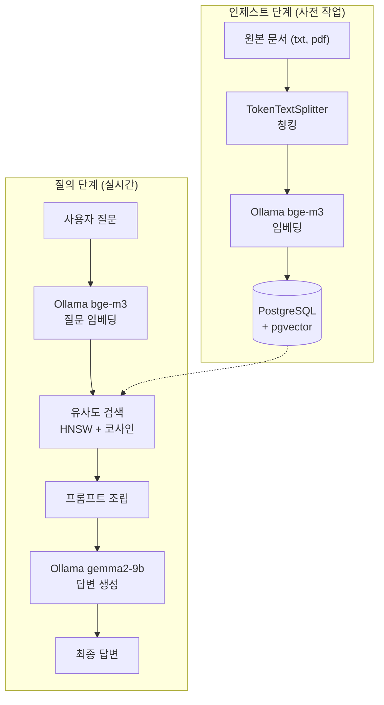
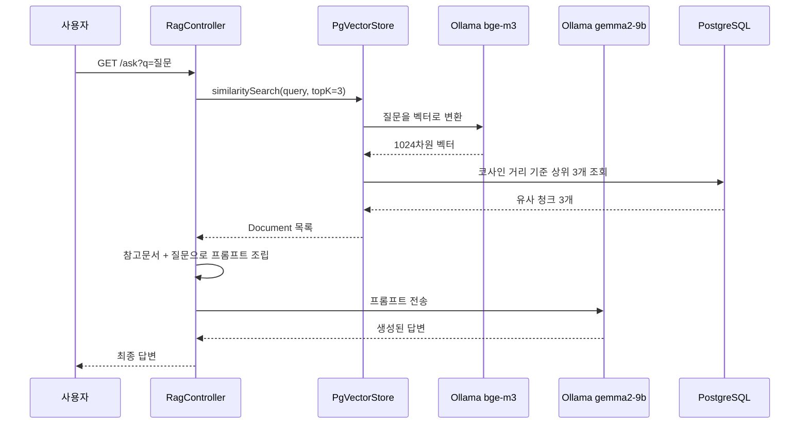
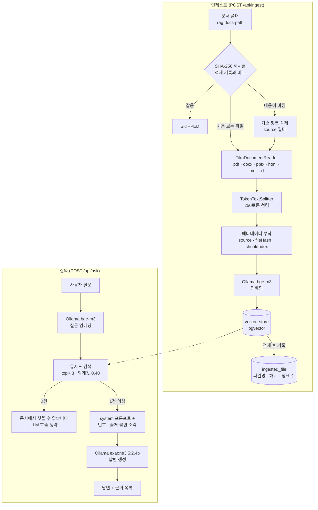
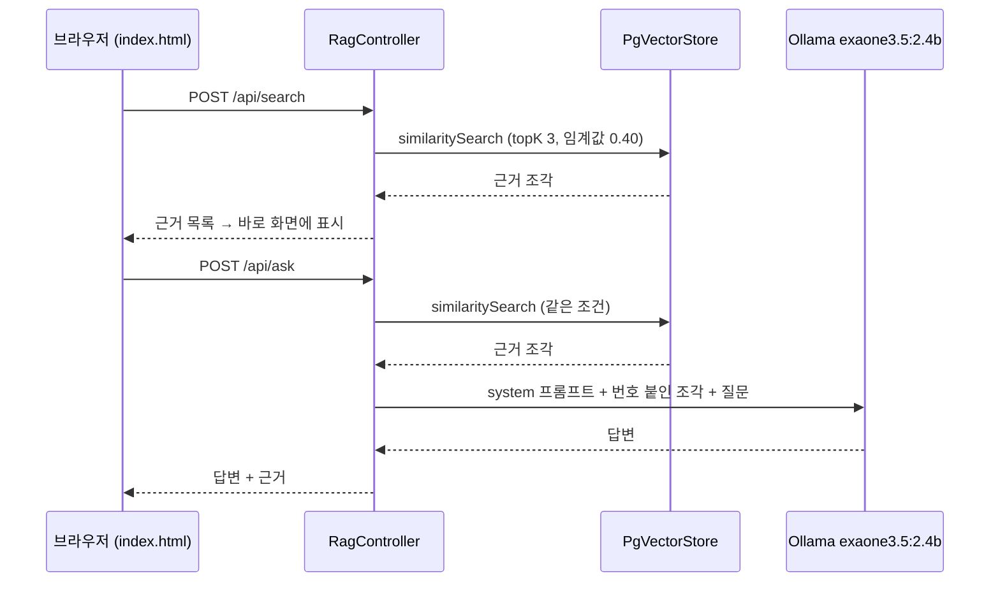

# Rag-Project

로컬 환경에서 동작하는 RAG(Retrieval-Augmented Generation) 시스템을 처음부터 끝까지 직접 구축한 개인 학습 프로젝트입니다.

외부 API나 유료 서비스 없이, **전부 로컬에서 돌아가는 완결된 파이프라인**을 만드는 것을 목표로 했습니다. 문서를 넣으면 그 문서에 근거해서만 답변하는 챗봇이 최종 결과물입니다.

> **업데이트** — 1차 구현(텍스트 파일 한 개, `GET /ask`) 이후 폴더 단위 문서 적재, 중복 적재 방지, 출처 표시, 질의 화면을 더한 **2차 개선**을 진행했습니다. 본문의 아키텍처·구현 과정·트러블슈팅은 1차 구현 기록이고, 현재 코드 기준 구조와 실행 방법은 [2차 개선](#2차-개선) 섹션에 정리했습니다.

---

## 목차

- [왜 이걸 만들었나](#왜-이걸-만들었나)
- [RAG란](#rag란)
- [아키텍처](#아키텍처)
- [기술 스택](#기술-스택)
- [기술 선택 이유](#기술-선택-이유)
- [구현 과정](#구현-과정)
- [트러블슈팅](#트러블슈팅)
- [실행 결과](#실행-결과)
- [실행 방법](#실행-방법)
- [배운 점](#배운-점)
- [2차 개선](#2차-개선)
- [앞으로 할 것](#앞으로-할-것)

---

## 왜 이걸 만들었나

현재 SI 회사에서 Java, Spring, 전자정부 표준프레임워크를 사용하는 레거시 프로젝트에 투입되어 있습니다.

LLM을 애플리케이션에 붙이는 일이 늘어나고 있는데, 개념만 알고 직접 만들어본 적은 없었습니다. "RAG가 뭔지 안다"와 "RAG를 만들어봤다"는 다르다고 생각해서, 파이프라인 전체를 직접 엮어보기로 했습니다.

언어를 Java로 정한 것도 의도적입니다. RAG 예제는 대부분 Python(LangChain)으로 되어 있지만, 현재 업무 스택이 Java/Spring이라 **RAG 개념과 실무 스택을 동시에 익히는 쪽**을 택했습니다.

---

## RAG란

LLM은 학습한 시점까지의 지식만 가지고 있고, 내 회사의 내부 문서 같은 건 알지 못합니다. 그렇다고 모르는 걸 모른다고 하지도 않고 그럴듯하게 지어냅니다(할루시네이션).

RAG는 이 문제를 이렇게 해결합니다.

1. 내 문서를 미리 검색 가능한 형태로 저장해둔다
2. 질문이 들어오면 관련 있는 부분을 찾아온다
3. 찾아온 내용을 질문과 함께 LLM에게 주면서 "이것만 보고 답하라"고 시킨다

핵심은 **의미 기반 검색**입니다. 단순 키워드 매칭이 아니라, 텍스트를 벡터(숫자 배열)로 바꾼 뒤 벡터 간 거리를 계산해서 "의미가 비슷한" 문서를 찾습니다. 그래서 "임베딩이 뭔가요"라고 물어도 "임베딩"이라는 단어가 정확히 없는 문장까지 찾아올 수 있습니다.

---

## 아키텍처

### 전체 구조



### 데이터 흐름 상세



### DB 스키마

Spring AI가 `initialize-schema: true` 설정에 따라 자동 생성한 테이블입니다.

```
                     Table "public.vector_store"
  Column   |     Type     | Nullable |      Default
-----------+--------------+----------+--------------------
 id        | uuid         | not null | uuid_generate_v4()
 content   | text         |          |
 metadata  | json         |          |
 embedding | vector(1024) |          |
Indexes:
    "vector_store_pkey" PRIMARY KEY, btree (id)
    "spring_ai_vector_index" hnsw (embedding vector_cosine_ops)
```

`vector(1024)` 타입이 pgvector 확장이 제공하는 벡터 전용 컬럼입니다. 일반 PostgreSQL에는 없습니다.

---

## 기술 스택

### 애플리케이션

| 구분       | 기술                                | 버전       |
| ---------- | ----------------------------------- | ---------- |
| 언어       | Java (Eclipse Temurin)              | 25.0.4 LTS |
| 프레임워크 | Spring Boot                         | 4.1.1      |
| AI 통합    | Spring AI                           | 2.0.1      |
| 빌드 도구  | Gradle                              | -          |
| 웹         | Spring WebMVC (내장 Tomcat 11.0.24) | -          |

### 인프라

| 구분          | 기술                         | 버전/설정              |
| ------------- | ---------------------------- | ---------------------- |
| 벡터 DB       | PostgreSQL + pgvector        | pgvector/pgvector:pg17 |
| 컨테이너      | Docker Desktop (WSL2 백엔드) | -                      |
| LLM 런타임    | Ollama                       | -                      |
| 커넥션 풀     | HikariCP                     | 7.0.2                  |
| JDBC 드라이버 | PostgreSQL JDBC              | 42.7.13                |
| 벡터 바인딩   | pgvector-java                | 0.1.6                  |

### 모델

| 용도             | 모델             | 크기     | 차원 |
| ---------------- | ---------------- | -------- | ---- |
| 임베딩           | `bge-m3`         | 약 1.2GB | 1024 |
| 답변 생성        | `gemma2:9b`      | 약 5.4GB | -    |
| 답변 생성 (대안) | `exaone3.5:7.8b` | 약 4.8GB | -    |
| 답변 생성 (2차 기본값) | `exaone3.5:2.4b` | 약 1.6GB | -    |

### 주요 설정값

```yaml
spring:
  ai:
    ollama:
      chat:
        options:
          model: gemma2:9b
          temperature: 0.3
      embedding:
        options:
          model: bge-m3
    vectorstore:
      pgvector:
        initialize-schema: true
        dimensions: 1024
        index-type: HNSW
        distance-type: COSINE_DISTANCE
```

---

## 기술 선택 이유

### 왜 Java + Spring AI인가

RAG 튜토리얼은 대부분 Python/LangChain입니다. 그쪽이 자료도 많고 빠릅니다.

그럼에도 Java를 택한 이유는 **현재 업무 스택이 Java/Spring**이기 때문입니다. 개념만 배우고 끝나는 것보다, 실제로 쓰는 언어로 만들어야 나중에 응용할 수 있다고 판단했습니다. Spring AI는 Python 진영의 LangChain에 해당하는 역할을 하며, LLM 호출·임베딩·벡터스토어를 Spring 스타일로 추상화해줍니다.

부수적으로, 회사에서 쓰는 전자정부 프레임워크(XML 설정, 레거시 Spring)와 최신 Spring Boot를 비교 체험할 수 있다는 이점도 있었습니다. 같은 Spring인데 설정 방식과 구조가 얼마나 달라졌는지 직접 느낄 수 있었습니다.

### 왜 pgvector인가

전용 벡터 DB(Pinecone, Weaviate 등)가 아니라 PostgreSQL 확장을 택했습니다.

- **별도 서비스 가입, API 키, 요금 개념이 없습니다.** 학습 초반에 이런 게 붙으면 본질에서 멀어집니다.
- **벡터 검색이 특별한 마법이 아니라 그냥 SQL 쿼리라는 걸 직접 볼 수 있습니다.** `psql`로 접속해서 테이블 구조를 확인하고 데이터를 조회하면서 내부 동작을 이해할 수 있었습니다.
- Spring에서 JDBC로 붙이는 방식이 익숙한 그대로입니다.
- 실무에서도 이미 PostgreSQL을 쓰는 조직이라면 별도 인프라 추가 없이 도입 가능합니다.

`pgvector/pgvector:pg17` 이미지를 쓴 이유는 pgvector 확장이 미리 설치되어 있어서, 별도로 컴파일하거나 설치할 필요가 없기 때문입니다.

### 왜 Ollama(로컬)인가

OpenAI API를 쓰면 설정이 더 간단하고 품질도 좋습니다. 그럼에도 로컬을 택한 이유는,

- **비용이 0입니다.** 학습 과정에서 수백 번 호출해도 부담이 없습니다.
- **오프라인으로 동작합니다.** 네트워크 제약이 있는 환경에서도 실험 가능합니다.
- **데이터가 외부로 나가지 않습니다.** 사내 문서를 다루는 시나리오를 상정할 때 이 점이 중요합니다. 실무에서 RAG 도입을 검토한다면 보안 때문에 로컬/온프레미스가 요구되는 경우가 많습니다.
- 모델을 직접 교체하며 비교할 수 있습니다.

### 왜 bge-m3인가 (임베딩)

임베딩 모델이 RAG 품질의 절반 이상을 좌우합니다. 검색이 엉뚱한 문서를 가져오면, 답변 모델이 아무리 좋아도 결과는 틀립니다.

`bge-m3`는 다국어를 지원하며 한국어 문서 검색에서 검증된 모델입니다. 한국어 문서를 다룰 계획이었으므로 영어 중심 모델(예: `nomic-embed-text`) 대신 이쪽을 택했습니다.

출력이 **1024차원**이라, DB 설정의 `dimensions` 값도 1024로 맞춰야 합니다. 이 값이 틀리면 저장 시점에 오류가 납니다.

### 왜 gemma2:9b인가 (답변 생성)

처음에는 `qwen2.5:7b`를 받았으나 문제가 있어 교체했습니다. (아래 트러블슈팅 참고)

`gemma2:9b`는 구글 모델로 다국어 균형이 좋아 한국어에서 언어가 섞이는 현상이 거의 없었습니다. RAM 16GB 환경에서 무리 없이 동작합니다.

LG AI연구원의 `exaone3.5:7.8b`도 함께 받아 비교했습니다. 한국어 품질은 이쪽이 더 낫지만 라이선스가 연구/비상업 목적으로 제한되어 있어, 기본 모델은 gemma2로 두고 비교용으로 유지 중입니다.

### 왜 HNSW / 코사인 거리인가

- **HNSW(Hierarchical Navigable Small World)**: 벡터 검색을 빠르게 하는 인덱스 방식입니다. 지금처럼 데이터가 적을 땐 체감이 없지만, 문서가 늘어나면 전체 스캔과 큰 차이가 납니다.
- **코사인 거리**: 두 벡터가 얼마나 비슷한지 재는 방법 중 하나로, 벡터의 크기가 아니라 **방향**만 비교합니다. 문서 길이에 영향을 덜 받아 텍스트 유사도 측정에 일반적으로 쓰입니다.

### 왜 temperature 0.3인가

`temperature`는 답변의 무작위성을 조절합니다. 값이 높으면 창의적이지만 사실에서 벗어나기 쉽습니다.

RAG는 **주어진 문서에 충실한 답변**이 목적이므로 낮게 잡았습니다. 창작이 아니라 근거 기반 응답이 필요한 작업입니다.

---

## 구현 과정

### 1단계: 개발 환경 구성

| 항목           | 내용                                                 |
| -------------- | ---------------------------------------------------- |
| JDK            | Temurin 25.0.4 LTS (`JAVA_HOME` 설정 확인)           |
| Git            | 2.55.0                                               |
| Docker Desktop | WSL2 백엔드, 디스크 이미지 위치를 D 드라이브로 변경  |
| Ollama         | `OLLAMA_MODELS` 환경변수를 `D:\ollama\models`로 변경 |

모델과 컨테이너 이미지가 수 GB 단위라, **설치 직후 저장 경로를 별도 드라이브로 옮기는 작업**을 먼저 했습니다. 모델을 받은 뒤에 경로를 바꾸면 다시 받아야 하므로 순서가 중요합니다.

### 2단계: 벡터 DB 컨테이너 실행

`docker-compose.yml`

```yaml
services:
  postgres:
    image: pgvector/pgvector:pg17
    container_name: rag-postgres
    restart: unless-stopped
    environment:
      POSTGRES_USER: raguser
      POSTGRES_PASSWORD: ragpass
      POSTGRES_DB: ragdb
    ports:
      - "5432:5432"
    volumes:
      - pgdata:/var/lib/postgresql/data

volumes:
  pgdata:
```

```bash
docker compose up -d
```

`restart: unless-stopped`를 넣어 Docker Desktop이 켜지면 컨테이너도 함께 시작되도록 했습니다. 초기에는 이 설정이 없어서 매번 수동으로 켜야 했습니다.

pgvector 확장이 실제로 동작하는지 확인:

```bash
docker exec -it rag-postgres psql -U raguser -d ragdb \
  -c "CREATE EXTENSION IF NOT EXISTS vector; SELECT extversion FROM pg_extension WHERE extname='vector';"
```

### 3단계: Spring Boot 프로젝트 생성

`start.spring.io`에서 다음 의존성으로 생성했습니다.

```gradle
dependencies {
    implementation 'org.springframework.boot:spring-boot-starter-data-jdbc'
    implementation 'org.springframework.boot:spring-boot-starter-webmvc'
    implementation 'org.springframework.ai:spring-ai-starter-model-ollama'
    implementation 'org.springframework.ai:spring-ai-starter-vector-store-pgvector'
    implementation 'org.springframework.ai:spring-ai-vector-store-advisor'
}
```

설정 형식은 properties 대신 **YAML**을 택했습니다. RAG 설정은 `spring.ai.ollama.chat.options.model`처럼 계층이 깊어서, properties로 쓰면 같은 접두사가 계속 반복됩니다. Spring AI 공식 문서 예제도 대부분 YAML이라 참고 자료를 그대로 활용하기 좋습니다.

### 4단계: 인제스트 파이프라인 (문서 → 벡터)

```java
@Component
public class IngestService implements ApplicationRunner {

    private final VectorStore vectorStore;

    @Value("classpath:docs/sample.txt")
    private Resource sampleDoc;

    @Override
    public void run(ApplicationArguments args) throws Exception {
        String text = sampleDoc.getContentAsString(StandardCharsets.UTF_8);
        Document document = new Document(text);

        TokenTextSplitter splitter = TokenTextSplitter.builder()
                .withChunkSize(200)
                .withMinChunkSizeChars(100)
                .withMinChunkLengthToEmbed(5)
                .withMaxNumChunks(1000)
                .withKeepSeparator(true)
                .build();

        List<Document> chunks = splitter.split(List.of(document));
        vectorStore.add(chunks);
    }
}
```

**청킹이 RAG 품질을 크게 좌우합니다.** 너무 잘게 쪼개면 문맥이 사라지고, 너무 크게 잡으면 관련 없는 내용이 섞여 검색 정확도가 떨어집니다. `chunkSize`와 겹침(overlap) 값은 문서 성격에 따라 조정해야 하는 튜닝 포인트입니다.

주목할 점은 `vectorStore.add(chunks)` **한 줄이 임베딩과 저장을 동시에 처리**한다는 것입니다. Spring AI가 내부적으로 Ollama의 `bge-m3`를 호출해 각 청크를 1024차원 벡터로 변환한 뒤 pgvector에 저장합니다.

### 5단계: 검색 + 답변 생성

```java
@GetMapping("/ask")
public String ask(@RequestParam String q) {
    List<Document> docs = vectorStore.similaritySearch(
            SearchRequest.builder().query(q).topK(3).build()
    );

    String context = docs.stream()
            .map(Document::getText)
            .collect(Collectors.joining("\n---\n"));

    String prompt = """
            아래 참고 문서만을 근거로 질문에 답하세요.
            문서에 없는 내용은 "문서에서 찾을 수 없습니다"라고 답하세요.

            [참고 문서]
            %s

            [질문]
            %s
            """.formatted(context, q);

    return chatClient.prompt().user(prompt).call().content();
}
```

프롬프트의 **"문서에 없는 내용은 찾을 수 없다고 답하라"** 지시가 핵심입니다. 이 문장이 없으면 모델이 자체 지식으로 답을 지어내고, 그러면 RAG를 쓰는 의미가 사라집니다. 실제로 이 지시가 동작하는지 검증하는 테스트를 별도로 수행했습니다.

검증용으로 검색 결과만 확인하는 엔드포인트도 만들었습니다.

```java
@GetMapping("/search")
public List<String> search(@RequestParam String q) {
    List<Document> docs = vectorStore.similaritySearch(
            SearchRequest.builder().query(q).topK(3).build()
    );
    return docs.stream().map(Document::getText).toList();
}
```

답변이 이상할 때 **검색 단계 문제인지 생성 단계 문제인지 구분**하기 위한 것입니다. 검색이 엉뚱한 청크를 가져오는 건데 프롬프트만 고치고 있으면 시간을 낭비하게 됩니다.

---

## 트러블슈팅

### 1. DataSource 설정 누락

```
APPLICATION FAILED TO START

Description:
Failed to configure a DataSource: 'url' attribute is not specified
and no embedded datasource could be configured.

Reason: Failed to determine a suitable driver class
```

**원인**: `application.yml`이 비어 있어 DB 접속 정보가 없었습니다. 컨테이너는 떠 있었지만 애플리케이션은 어디에 연결할지 몰랐습니다.

**해결**: `spring.datasource` 설정 추가. `docker-compose.yml`에 지정한 사용자명/비밀번호/DB명과 정확히 일치시켜야 합니다.

**배운 점**: 로그에 `PgVectorStoreAutoConfiguration`이 언급된 걸 보고, 의존성 자체는 정상적으로 잡혔다는 걸 확인할 수 있었습니다. 오류 메시지에서 "무엇이 실패했는가"뿐 아니라 "어디까지 진행됐는가"도 읽을 수 있습니다.

### 2. TokenTextSplitter 생성자 시그니처 변경

```
Cannot resolve constructor 'TokenTextSplitter(int, int, int, int, boolean)'
```

**원인**: 참고한 예제가 이전 버전 기준이었습니다. Spring AI 2.0.1에서 `punctuationMarks` 파라미터가 추가되어 인자가 5개에서 6개로 늘었습니다.

**해결**: IDE가 제시한 후보 목록에서 현재 버전의 시그니처를 확인해 수정했습니다.

**배운 점**: 라이브러리 버전이 빠르게 올라가는 영역에서는 인터넷 예제를 그대로 복사하면 안 됩니다. IDE의 자동완성과 시그니처 힌트가 가장 정확한 문서입니다.

### 3. Deprecated 경고

```
'TokenTextSplitter(int, int, int, int, boolean, List<Character>)'
is deprecated since version 2.0.0-M3 and marked for removal

Deprecated since 2.0.0-M3, use builder() instead.
```

**원인**: 생성자 방식이 폐기 예정으로 표시되어 있었습니다.

**해결**: 빌더 패턴으로 변경.

```java
TokenTextSplitter.builder()
        .withChunkSize(200)
        .withMinChunkSizeChars(100)
        .build();
```

**배운 점**: 인자가 많은 생성자는 `new TokenTextSplitter(200, 100, 5, 1000, true, ...)` 처럼 숫자만 나열되어 무엇이 무엇인지 알 수 없고, 순서를 바꿔 넣어도 컴파일이 됩니다. 빌더는 이름이 붙어 읽기 쉽고 실수를 줄입니다. 라이브러리들이 빌더로 옮겨가는 이유를 체감했습니다.

또한 `@Deprecated`는 "이미 지웠다"가 아니라 "곧 지울 테니 미리 옮기라"는 단계적 폐기 절차라는 것도 정리할 수 있었습니다. 회사 레거시 코드에서 자주 마주치는 개념입니다.

### 4. Docker 데몬 미실행

```
failed to connect to the docker API at npipe:////./pipe/dockerDesktopLinuxEngine;
check if the path is correct and if the daemon is running
```

**원인**: `docker` 명령줄 도구는 설치되어 있지만, 실제로 컨테이너를 실행하는 엔진(Docker Desktop)이 꺼져 있었습니다.

**해결**: Docker Desktop 실행 후 WSL2 부팅 완료까지 대기.

**배운 점**: CLI와 데몬이 분리되어 있다는 구조를 이해하게 됐습니다. 명령어가 인식되는 것과 서비스가 동작하는 것은 별개입니다.

### 5. 컨테이너 중지 상태에서의 연결 거부

```
Caused by: org.postgresql.util.PSQLException: localhost:5432 에 대한 연결이 거부되었습니다.
Caused by: java.net.ConnectException: Connection refused: getsockopt
```

**원인**: PC 재시작 후 컨테이너가 자동으로 켜지지 않았습니다.

**해결**: `docker compose start` 로 재시작. 이후 `restart: unless-stopped` 옵션을 추가해 재발을 막았습니다.

**배운 점**: 긴 스택트레이스는 **맨 아래 `Caused by`부터 읽어야** 진짜 원인이 보입니다.

```
UnsatisfiedDependencyException          ← 결과
  └ BeanCreationException               ← 결과
     └ CannotGetJdbcConnectionException ← 결과
        └ PSQLException 연결 거부        ← 진짜 원인
           └ ConnectException           ← 가장 근본
```

위에서부터 읽으면 "빈 생성 실패"만 보여 스프링 설정을 의심하게 되지만, 실제로는 인프라 문제였습니다.

### 6. LLM의 한국어/중국어 혼용

처음 선택한 `qwen2.5:7b`에서 발생한 문제입니다.

```
>>> 너의 이름은 qwen인가요?
네, 맞습니다. 저는 Qwen인assistants由阿里云开发的大规模语言模型，我叫Qwen。

>>> 갑자기 한자가 나오는데요. 한국어도 대답해주세요.
네,當然可以！我的名字是Qwen。有任何需要幫助的地方嗎？
```

**원인**: Qwen은 중국에서 개발된 모델로 학습 데이터의 중국어 비중이 높습니다. 한국어로 답하려다 문장 중간에 중국어 토큰의 확률이 높아지면 그쪽으로 전환되는 현상입니다. 파라미터 수가 적은 모델일수록 심합니다.

**해결**: `gemma2:9b`로 교체. 프롬프트로 언어를 강제하는 방법도 있지만, 대화가 길어지면 다시 이탈하는 경우가 많아 근본 해결이 아니라고 판단했습니다.

**배운 점**: 모델 선택 시 벤치마크 점수뿐 아니라 **대상 언어에 대한 학습 데이터 비중**을 고려해야 합니다. 그리고 설정 파일에서 모델명 한 줄만 바꾸면 교체가 되는 구조라, 초반에 모델을 확정하지 못해도 진행에 지장이 없다는 것도 확인했습니다.

### 7. 중복 저장

`/search` 결과에 동일한 내용이 두 번 나타났습니다.

**원인**: `IngestService`가 `ApplicationRunner`로 구현되어 애플리케이션이 실행될 때마다 같은 문서를 다시 저장했습니다.

**해결 (현재)**: 테스트 시에는 `@Component`를 주석 처리하고, 문서를 넣을 때만 활성화. 누적된 데이터는 아래로 정리.

```sql
DELETE FROM vector_store;
```

**앞으로 개선할 것**: 문서의 해시값이나 파일명을 `metadata`에 저장해두고, 이미 저장된 문서면 건너뛰는 로직이 필요합니다. 실제 서비스라면 필수입니다.

---

## 실행 결과

### 1. 인제스트 확인

애플리케이션 실행 시 콘솔 출력:

```
Started RagApplication in 3.821 seconds
=== 원본 1개 문서를 1개 청크로 분할 ===
[청크 0] 펜타시스템테크놀러지는 B2B 기업용 IT 서비스를 제공하는 회사다.
=== 벡터 저장 완료 ===
```

DB 확인:

```bash
docker exec -it rag-postgres psql -U raguser -d ragdb -c "SELECT count(*) FROM vector_store;"
```

```
 count
-------
     1
```

### 2. 벡터 검색

```
GET http://localhost:8080/search?q=임베딩이 뭔가요
```

질문에 "임베딩"이라는 단어가 포함된 청크가 유사도 기준으로 반환되는 것을 확인했습니다.

### 3. RAG 답변 생성

```
GET http://localhost:8080/ask?q=bge-m3는 몇 차원인가요
```

```
bge-m3는 1024차원입니다.
```

이 정보는 모델이 원래 학습한 지식이 아니라, **저장된 문서에서 검색해온 내용**을 근거로 생성된 답변입니다.

### 4. 할루시네이션 방지 검증 (가장 중요)

```
GET http://localhost:8080/ask?q=오늘 서울 날씨는 어때
```

```
문서에서 찾을 수 없습니다.
```

문서에 없는 내용을 물었을 때 지어내지 않고 모른다고 답했습니다. **RAG가 의도대로 동작하고 있다는 가장 확실한 증거**입니다. 이 검증이 없으면 "우연히 맞는 답이 나온 것"과 구분할 수 없습니다.

---

## 실행 방법

> 아래는 1차 구현 기준입니다. 2차 개선 이후 답변 모델, 문서 위치, API 경로가 바뀌었으니 현재 코드는 [실행 방법 (2차 기준)](#실행-방법-2차-기준)을 따르세요.

### 사전 요구사항

- JDK 21 이상 (Java 25 권장)
- Docker Desktop
- Ollama
- RAM 16GB 이상 권장

### 1. 모델 다운로드

```bash
ollama pull bge-m3
ollama pull gemma2:9b
```

모델 저장 위치를 변경하려면 `OLLAMA_MODELS` 환경변수를 설정한 뒤 다운로드하세요.

```bash
setx OLLAMA_MODELS "D:\ollama\models"
```

### 2. 벡터 DB 실행

```bash
docker compose up -d
docker ps   # rag-postgres가 Up 상태인지 확인
```

### 3. 애플리케이션 실행

```bash
./gradlew bootRun
```

### 4. 테스트

```bash
curl "http://localhost:8080/search?q=임베딩이 뭔가요"
curl "http://localhost:8080/ask?q=bge-m3는 몇 차원인가요"
```

> **주의**: 첫 요청은 모델을 메모리에 로드하느라 20~60초 걸릴 수 있습니다.

### 실행 순서 체크리스트

매번 작업 시작할 때 확인할 항목입니다. 하나라도 빠지면 연결 오류가 발생합니다.

- [ ] Docker Desktop 실행 (트레이 아이콘 확인)
- [ ] `docker ps` 로 `rag-postgres` Up 상태 확인
- [ ] Ollama 실행 중 (트레이 아이콘 확인)
- [ ] 애플리케이션 실행

---

## 배운 점

**RAG는 마법이 아니라 조립입니다.** 처음엔 거창해 보였지만, 실제로는 임베딩 모델 호출, 벡터 DB 저장, 유사도 쿼리, 프롬프트 문자열 조립의 연결이었습니다. 각 단계를 직접 만들어보니 어디를 손봐야 품질이 좋아지는지 감이 잡혔습니다.

**품질은 검색 단계에서 결정됩니다.** 답변이 이상할 때 LLM을 바꾸는 것보다, 임베딩 모델과 청킹 전략을 점검하는 게 먼저입니다. 검색이 엉뚱한 문서를 가져오면 어떤 모델을 써도 소용없습니다.

**프롬프트 한 줄이 시스템의 성격을 바꿉니다.** "문서에 없으면 없다고 답하라"는 지시 하나로 할루시네이션 여부가 갈렸습니다.

**추상화의 양면성.** `vectorStore.add(chunks)` 한 줄이 임베딩과 저장을 모두 처리하는 건 편리하지만, 내부에서 무슨 일이 일어나는지 모르면 오류가 났을 때 손을 못 댑니다. `psql`로 직접 테이블을 확인하며 진행한 게 도움이 됐습니다.

**로그 읽는 법.** 스택트레이스는 아래에서 위로 읽어야 원인이 보입니다. 업무에서 레거시 코드를 다룰 때도 그대로 쓰이는 요령입니다.

**최신 라이브러리를 다루는 자세.** Spring AI는 버전업이 빠른 프로젝트라, 인터넷 예제가 이미 낡은 경우가 많았습니다. IDE의 시그니처 힌트와 공식 문서를 우선하는 습관이 필요합니다.

---

## 2차 개선

1차 구현은 "RAG가 동작한다"를 확인하는 데까지였습니다. 텍스트 파일 하나를 앱이 뜰 때마다 다시 넣었고, 답변만 돌려줄 뿐 무엇을 근거로 했는지는 보이지 않았습니다.

2차에서는 1차의 [앞으로 할 것](#앞으로-할-것)에 적어 둔 항목 중 **PDF 지원, 중복 저장 방지, 출처 표시**를 구현하고, 브라우저에서 바로 질문할 수 있는 화면을 붙였습니다.

### 무엇이 바뀌었나

| 구분           | 1차                                      | 2차                                                                   |
| -------------- | ---------------------------------------- | --------------------------------------------------------------------- |
| 문서 입력      | classpath의 `sample.txt` 한 개           | 지정 폴더의 pdf·docx·pptx·html·md·txt 전체 (Tika)                     |
| 적재 시점      | 앱 실행마다 자동 (`ApplicationRunner`)   | `POST /api/ingest` 호출 시                                            |
| 중복 처리      | 실행할 때마다 같은 청크가 또 저장됨      | SHA-256 해시 비교로 새 파일·바뀐 파일만 적재                          |
| 청킹           | 200토큰 / 최소 100자 (코드에 고정)       | 250토큰 / 최소 120자 (`application.yml`로 분리)                       |
| 검색           | topK 3                                   | topK 3 + 유사도 임계값 0.40                                           |
| 근거 없는 질문 | LLM이 "찾을 수 없다"를 판단              | 임계값을 넘는 청크가 없으면 LLM을 부르지 않고 바로 응답               |
| 프롬프트       | user 메시지 하나에 지시 + 문서           | system(규칙) / user(번호·출처 붙인 조각 + 질문) 분리                  |
| 응답           | 답변 문자열                              | 답변 + 근거 목록(출처 파일, 점수, 발췌) JSON                          |
| API            | `GET /search`, `GET /ask`                | `/api/search`, `/api/ask`, `/api/ingest`, `/api/ingested`, `/api/config` |
| 화면           | 없음                                     | `static/index.html` 질의 화면                                         |
| 답변 모델      | `gemma2:9b`, temperature 0.3             | `exaone3.5:2.4b`, temperature 0.2, 출력 300토큰 제한                  |

### 패키지 구조

1차에서는 모든 클래스가 루트 패키지에 있었는데, 역할에 따라 `api`(요청 처리)와 `ingest`(문서 적재)로 나눴습니다.

```
src/main/java/com/example/rag
├── RagApplication.java
├── api
│   └── RagController.java           # 검색 · 질의 · 적재 API
└── ingest
    ├── IngestService.java           # 폴더 스캔 → 청킹 → 임베딩 → 적재
    └── IngestedFileRepository.java  # 적재 기록 테이블 (ingested_file)

src/main/resources
├── application.yml
└── static/index.html                # 질의 화면
```

### 전체 구조 (2차)



### 1. 폴더 단위 문서 적재 (Tika)

`spring-ai-tika-document-reader` 의존성을 추가하고 `TikaDocumentReader`로 문서를 읽습니다. Apache Tika는 파일 형식을 스스로 판별해 텍스트를 뽑아주기 때문에, PDF 전용 리더(`spring-ai-pdf-document-reader`) 대신 이쪽을 쓰면 **리더 하나로 PDF·Word·PowerPoint·HTML까지** 처리됩니다.

```gradle
implementation 'org.springframework.ai:spring-ai-tika-document-reader'
```

- `rag.docs-path` 폴더 **바로 아래의 파일만** 읽습니다. 하위 폴더는 읽지 않습니다.
- 확장자 목록(`pdf, doc, docx, ppt, pptx, html, htm, txt, md`)에 있는 파일만 대상으로 삼습니다.
- 텍스트를 뽑지 못한 파일(스캔 이미지로 된 PDF 등)은 `EMPTY`로 표시하고 건너뜁니다.

### 2. 중복 적재 방지

1차 [트러블슈팅 7번](#7-중복-저장)(실행할 때마다 같은 문서가 다시 저장됨)에서 "앞으로 개선할 것"으로 남겨 둔 부분입니다.

어떤 파일을 어떤 내용으로 적재했는지 기록하는 테이블을 따로 둡니다. 앱이 뜰 때 `@PostConstruct`에서 없으면 만듭니다.

```sql
CREATE TABLE IF NOT EXISTS ingested_file (
    file_name   TEXT PRIMARY KEY,
    file_hash   TEXT NOT NULL,
    chunk_count INT  NOT NULL,
    ingested_at TIMESTAMPTZ NOT NULL DEFAULT now()
)
```

적재할 때마다 파일의 SHA-256 해시를 계산해 기록과 비교합니다.

| 상황                                  | 처리                                       | 결과 상태 |
| ------------------------------------- | ------------------------------------------ | --------- |
| 처음 보는 파일                        | 청킹 → 임베딩 → 적재, 기록 추가            | `ADDED`   |
| 파일명은 같고 해시가 다름 (내용 수정) | 기존 청크를 지우고 다시 적재, 기록 갱신    | `UPDATED` |
| 파일명과 해시가 모두 같음             | 아무것도 하지 않음                         | `SKIPPED` |
| 텍스트 추출 실패                      | 적재하지 않음                              | `EMPTY`   |

변경 여부는 수정 날짜가 아니라 **파일 내용의 해시**로 판단합니다. 수정 날짜는 파일을 복사하거나 다시 저장하기만 해도 내용과 상관없이 바뀌기 때문입니다.

기존 청크는 청크마다 붙여 둔 `source` 메타데이터로 걸러서 지웁니다.

```java
vectorStore.delete(new Filter.Expression(
        Filter.ExpressionType.EQ,
        new Filter.Key("source"),
        new Filter.Value(fileName)));
```

`POST /api/ingest?force=true`로 호출하면 해시가 같아도 전부 다시 적재합니다. 청킹 설정을 바꿔 가며 실험할 때 씁니다.

### 3. 한국어 문서에 맞춘 청킹

```java
TokenTextSplitter.builder()
        .withChunkSize(chunkSize)                 // rag.chunk-size (250)
        .withMinChunkSizeChars(minChunkSizeChars) // rag.min-chunk-size-chars (120)
        .withMinChunkLengthToEmbed(30)
        .build();
```

Spring AI 기본값(800토큰 / 최소 350자)은 한글 문서에는 너무 커서 **청크 하나에 여러 주제가 섞입니다.** 주제가 섞인 청크는 어떤 질문과도 애매하게 비슷해져 검색 정확도가 떨어지므로 250토큰으로 줄였습니다. 30자보다 짧은 조각은 임베딩하지 않고 버립니다.

값은 `application.yml`로 빼서 코드 수정 없이 바꿀 수 있습니다. 바꾼 뒤에는 `?force=true`로 다시 적재해야 반영됩니다.

### 4. 출처 메타데이터

각 청크에 메타데이터 세 개를 붙입니다. Tika가 넣어 준 메타데이터는 그대로 두되, 이 세 키는 항상 덮어씁니다.

| 키           | 값                    | 쓰임                               |
| ------------ | --------------------- | ---------------------------------- |
| `source`     | 파일명                | 답변 근거 표시, 파일 단위 삭제     |
| `fileHash`   | 파일의 SHA-256        | 어느 버전의 파일에서 나온 청크인지 |
| `chunkIndex` | 파일 안에서의 순번    | 원문에서의 위치                    |

### 5. 검색 임계값과 '근거 없음' 처리

1차에서는 `topK(3)`만 지정해서, **어떤 질문이든 가장 가까운 청크(최대 3개)가 무조건 딸려왔습니다.** 문서와 상관없는 질문에도 LLM은 엉뚱한 문서를 받아 들고 "찾을 수 없다"를 스스로 판단해야 했습니다.

2차에서는 유사도 임계값을 걸었습니다.

```java
SearchRequest.builder()
        .query(question)
        .topK(topK)                               // rag.top-k (3)
        .similarityThreshold(similarityThreshold) // rag.similarity-threshold (0.40)
        .build();
```

임계값을 넘는 청크가 하나도 없으면 **LLM을 호출하지 않고** 바로 "문서에서 찾을 수 없습니다."를 돌려줍니다. 할루시네이션 방지를 프롬프트에만 맡기지 않고 검색 단계에서 먼저 거르는 셈이고, 수십 초 걸리는 답변 생성도 건너뜁니다.

### 6. 프롬프트 분리

규칙은 system 메시지로, 문서 조각과 질문은 user 메시지로 나눴습니다.

```text
아래 문서 조각을 근거로 질문에 한국어로 답하세요.

- 문서 조각에 있는 내용으로 답하고, 없는 내용은 지어내지 마세요.
- 문서에 쓰인 용어를 그대로 사용하세요.
- 목록을 묻는 질문이면 문서에 있는 항목을 빠짐없이 나열하세요.
- 답만 간결하게 쓰세요. 문서에 대한 설명, 사과, "문서에 따르면" 같은
  머리말은 붙이지 마세요.
- 어느 조각에도 근거가 없을 때만 "문서에서 찾을 수 없습니다"라고 답하세요.
```

user 메시지는 조각마다 번호와 출처를 붙여 조립합니다. 이 번호는 응답의 `sources[].index`와 같아서, 화면에서 답변과 근거를 이어 볼 수 있습니다.

```text
# 문서 조각
[1] 출처: 전자정부_표준프레임워크_개요.pdf
(청크 본문)

[2] 출처: ...

# 질문
(사용자 질문)
```

### 7. API

| 메서드 | 경로                        | 설명                                                                 |
| ------ | --------------------------- | -------------------------------------------------------------------- |
| POST   | `/api/ask`                  | 검색 + 답변 생성. 답변과 근거 목록을 함께 반환                       |
| POST   | `/api/search`               | 검색만 수행. 검색 품질을 눈으로 확인할 때 사용                       |
| POST   | `/api/ingest?force=false`   | 폴더를 훑어 새 파일·바뀐 파일만 적재. 파일별 결과(`status`) 반환     |
| GET    | `/api/ingested`             | 현재 적재된 파일 목록과 청크 수                                      |
| GET    | `/api/config`               | 화면 표시용 `topK`, `similarityThreshold`                            |

`/api/ask`, `/api/search`는 `{"question": "..."}` 형식의 JSON을 받습니다. 1차의 `GET ?q=` 방식과 달리 질문이 URL이 아니라 요청 본문에 실리므로, 한글이나 특수문자의 URL 인코딩을 신경 쓸 필요가 없습니다.

`/api/ask` 응답 예시:

```json
{
  "answer": "실행환경의 다섯 가지 서비스 그룹은 다음과 같습니다: ...",
  "sources": [
    {
      "index": 1,
      "source": "전자정부_표준프레임워크_개요.pdf",
      "score": 0.6839510202407837,
      "excerpt": "다섯 개의 서비스 그룹으로 나뉜다. · 화면처리 : 사용자 인터페이스와 요청 흐름을 담당한다. …"
    }
  ]
}
```

`excerpt`는 청크 앞부분 200자를 공백을 정리해 잘라 낸 것입니다.

### 8. 질의 화면

`src/main/resources/static/index.html` 한 파일에 HTML·CSS·JS를 모두 담았습니다. 별도 빌드 없이 앱을 띄우고 `http://localhost:8080`에 접속하면 됩니다.



- **두 단계 요청**: 검색은 금방 끝나고 답변 생성은 수십 초가 걸리기 때문에, `/api/search`로 근거를 먼저 보여 주고 이어서 `/api/ask`로 답변을 기다립니다. 기다리는 동안 경과 시간(초)을 표시합니다.
- **점수 막대**: 근거마다 유사도 점수를 막대로 그리고, 막대 위 세로선으로 임계값(0.40) 위치를 표시합니다. 기준선보다 얼마나 여유 있게 검색됐는지가 한눈에 보입니다.
- **인용 이동**: 답변 안에 `[1]` 같은 표기가 있으면 버튼으로 바꿔, 누르면 해당 근거로 이동합니다. 이전/다음 버튼으로 근거를 하나씩 넘겨 볼 수도 있습니다.
- **문서 관리**: 적재된 파일과 조각 수를 보여 주고, "새 문서 읽기"(`/api/ingest`)와 "전체 다시 읽기"(`?force=true`) 버튼을 둡니다.
- 검색 결과가 0건이면 답변 요청을 보내지 않고 "기준 점수를 넘는 문서 조각이 없습니다" 안내를 띄웁니다. 답변이 "찾을 수 없습니다"이면 답변 왼쪽 선을 빨간색으로 바꿔 구분합니다.
- `Ctrl+Enter`로도 질문을 보낼 수 있습니다.

### 9. 답변 모델과 생성 옵션

```yaml
spring:
  ai:
    ollama:
      chat:
        options:
          model: exaone3.5:2.4b
          temperature: 0.2
          num-predict: 300
          num-ctx: 4096
```

| 옵션          | 값               | 의미                                                                        |
| ------------- | ---------------- | --------------------------------------------------------------------------- |
| `model`       | `exaone3.5:2.4b` | LG AI연구원 EXAONE 3.5의 2.4B 모델. `gemma2:9b`(약 5.4GB)에서 약 1.6GB로 줄었습니다 |
| `temperature` | 0.2              | 1차의 0.3에서 더 낮췄습니다                                                 |
| `num-predict` | 300              | 한 번에 생성하는 최대 토큰 수. 답변 길이와 생성 시간의 상한                 |
| `num-ctx`     | 4096             | 모델이 한 번에 다루는 컨텍스트(입력 + 출력) 토큰 수                         |

> **라이선스 주의**: EXAONE 3.5는 2.4b도 7.8b와 같은 연구/비상업 목적 라이선스입니다. 상업적으로 쓰려면 답변 모델을 다시 골라야 합니다. 설정 파일에서 모델명 한 줄만 바꾸면 교체됩니다.

### 설정값 정리

```yaml
rag:
  docs-path: D:/dev/rag-docs   # 적재할 문서 폴더 (각자 환경에 맞게 변경)
  top-k: 3                     # 검색할 청크 수
  similarity-threshold: 0.40   # 이 점수 미만 청크는 근거에서 제외
  chunk-size: 250              # 청크 크기 (토큰)
  min-chunk-size-chars: 120    # 청크 최소 글자 수
```

### 실행 결과 (2차 기준)

전자정부 표준프레임워크 관련 PDF 3개를 적재한 상태에서 확인했습니다.

**1. 적재 목록** — `GET /api/ingested`

| 파일                               | 청크 수 |
| ---------------------------------- | ------- |
| 개발환경_설치_가이드.pdf           | 5       |
| 공통컴포넌트_활용_가이드.pdf       | 5       |
| 전자정부_표준프레임워크_개요.pdf   | 7       |

**2. 다시 적재해도 중복되지 않음** — `POST /api/ingest`

```json
[
  {"fileName":"개발환경_설치_가이드.pdf","status":"SKIPPED","chunkCount":0},
  {"fileName":"공통컴포넌트_활용_가이드.pdf","status":"SKIPPED","chunkCount":0},
  {"fileName":"전자정부_표준프레임워크_개요.pdf","status":"SKIPPED","chunkCount":0}
]
```

```bash
docker exec rag-postgres psql -U raguser -d ragdb -tAc \
  "SELECT metadata->>'source', count(*) FROM vector_store GROUP BY 1;"
```

```
공통컴포넌트_활용_가이드.pdf|5
전자정부_표준프레임워크_개요.pdf|7
개발환경_설치_가이드.pdf|5
```

내용이 그대로인 파일은 모두 건너뛰었고, DB의 청크 수도 적재 목록과 같은 17개 그대로입니다. 1차에서 앱을 켤 때마다 청크가 불어나던 문제가 해결됐습니다.

**3. 문서에 있는 질문** — `POST /api/ask`

```json
{"question": "실행환경의 다섯 가지 서비스 그룹이 뭔가요?"}
```

```
실행환경의 다섯 가지 서비스 그룹은 다음과 같습니다:

1. 화면처리
2. 업무처리
3. 데이터처리
4. 연계통합
5. 공통기반
```

| 근거 | 출처                               | 점수  |
| ---- | ---------------------------------- | ----- |
| 1    | 전자정부_표준프레임워크_개요.pdf   | 0.684 |
| 2    | 전자정부_표준프레임워크_개요.pdf   | 0.528 |
| 3    | 전자정부_표준프레임워크_개요.pdf   | 0.515 |

1번 근거가 "다섯 개의 서비스 그룹으로 나뉜다. · 화면처리 : …"로 시작하는 청크이고, 답변의 다섯 항목이 모두 여기에 있습니다. 첫 요청 기준으로 답변까지 약 20초가 걸렸습니다.

**4. 문서에 없는 질문** — `POST /api/ask`

```json
{"question": "오늘 서울 날씨는 어때"}
```

```json
{"answer": "문서에서 찾을 수 없습니다.", "sources": []}
```

임계값 0.40을 넘는 청크가 하나도 없어 **LLM을 호출하지 않고 즉시** 응답했습니다. 1차에서는 임계값이 없어 같은 질문에도 가장 가까운 청크가 그대로 LLM에 전달됐습니다.

### 실행 방법 (2차 기준)

**1. 모델 다운로드**

```bash
ollama pull bge-m3
ollama pull exaone3.5:2.4b
```

**2. 벡터 DB 실행** — `docker-compose.yml` 내용은 [2단계](#2단계-벡터-db-컨테이너-실행) 참고

```bash
docker compose up -d
```

**3. 문서 준비** — `application.yml`의 `rag.docs-path`를 문서 폴더로 지정하고, 그 폴더에 pdf·docx·pptx·html·md·txt 파일을 넣습니다.

**4. 애플리케이션 실행**

```bash
./gradlew bootRun
```

**5. 사용**

브라우저에서 `http://localhost:8080`에 접속해 아래쪽 **적재된 문서**를 펼치고 **새 문서 읽기**를 누른 뒤 질문합니다.

API로 직접 호출할 수도 있습니다.

```bash
# 새 문서·바뀐 문서 적재 (전부 다시 적재하려면 ?force=true)
curl -X POST "http://localhost:8080/api/ingest"

# 질문
curl -X POST "http://localhost:8080/api/ask" \
  -H "Content-Type: application/json" \
  -d '{"question": "실행환경의 다섯 가지 서비스 그룹이 뭔가요?"}'
```

> 적재는 청크마다 임베딩을 계산하므로 문서가 많으면 오래 걸립니다. 한 번 적재한 뒤에는 바뀐 파일만 다시 처리합니다.

---

## 앞으로 할 것

### 기능

- [x] PDF 문서 지원 → 2차에서 Tika로 pdf·docx·pptx·html·md·txt까지 지원
- [ ] 전자정부 표준프레임워크 공식 문서를 대상 데이터로 적용
- [x] 중복 저장 방지 (문서 해시 기반 체크) → 2차에서 SHA-256 + `ingested_file` 테이블로 구현
- [x] 답변에 출처(어떤 문서의 어느 부분인지) 표시 → 2차에서 파일명·점수·발췌 반환
- [ ] 문서 업로드 API

### 프론트엔드

- [ ] React / Next.js 기반 채팅 UI (2차에서는 정적 HTML 한 장으로 질의 화면 구현)
- [ ] 스트리밍 응답 (토큰 단위 출력)
- [x] 검색된 청크를 함께 표시 → 2차 질의 화면의 근거 목록과 점수 막대

### 인프라

- [ ] 배포 (접속 가능한 데모 링크 제공)
- [ ] 청크 크기와 `topK` 값에 따른 검색 품질 비교 실험 (설정값 분리와 `?force=true` 재적재까지 준비)

---

## 라이선스

개인 학습 목적의 프로젝트입니다.
