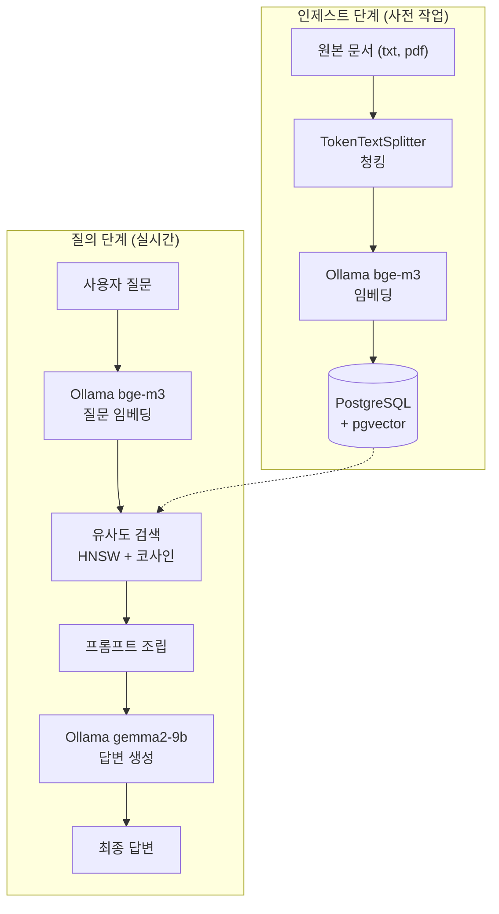
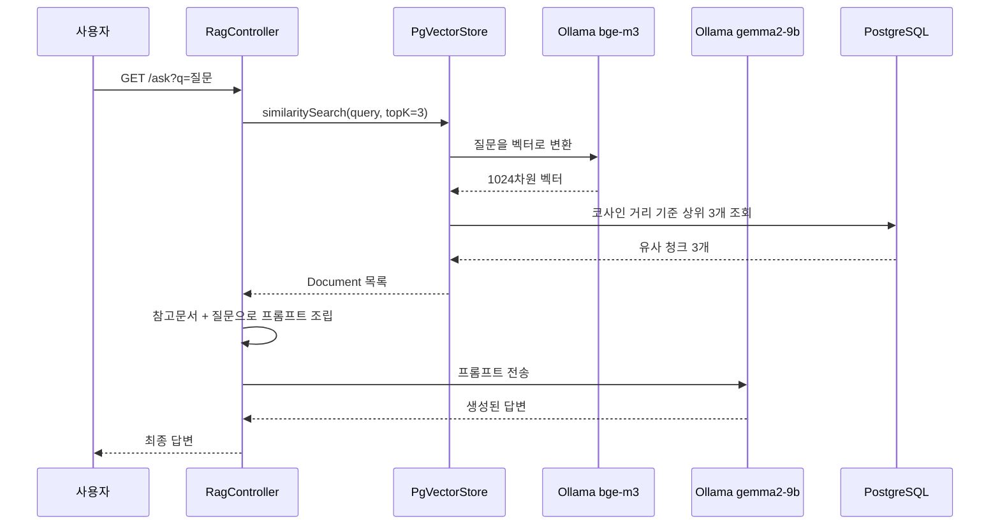

# 1차 구현 — 로컬 RAG 파이프라인 구축

> [README](../README.md) · **1차 구현** · [2차 개선](2차_개선.md) · [3차 개선](3차_개선.md)

텍스트 파일 하나를 넣고, 그 문서에 근거해서만 답하는 RAG 파이프라인을 처음부터 끝까지 연결한 단계입니다.

## 한눈에 보기

| 항목     | 내용                                                              |
| -------- | ----------------------------------------------------------------- |
| 목표     | 문서 적재 → 검색 → 답변 생성까지 RAG 전체 흐름을 직접 엮어 보기   |
| 입력     | classpath의 `sample.txt` 한 개                                    |
| 적재     | 앱이 뜰 때마다 자동 (`ApplicationRunner`)                          |
| API      | `GET /search`, `GET /ask`                                         |
| 모델     | 임베딩 `bge-m3` / 답변 `gemma2:9b` (temperature 0.3)              |
| 결과     | 문서에 있는 질문은 문서대로 답하고, 없는 질문은 "문서에서 찾을 수 없습니다" |

## 목차

- [아키텍처](#아키텍처)
- [기술 선택 이유](#기술-선택-이유)
- [구현 과정](#구현-과정)
- [트러블슈팅](#트러블슈팅)
- [실행 결과](#실행-결과)
- [배운 점](#배운-점)
- [앞으로 할 것](#앞으로-할-것)

---

## 아키텍처

### 전체 구조



### 데이터 흐름 상세



### DB 스키마

Spring AI가 `initialize-schema: true` 설정에 따라 자동 생성한 테이블입니다.

```
                     Table "public.vector_store"
  Column   |     Type     | Nullable |      Default
-----------+--------------+----------+--------------------
 id        | uuid         | not null | uuid_generate_v4()
 content   | text         |          |
 metadata  | json         |          |
 embedding | vector(1024) |          |
Indexes:
    "vector_store_pkey" PRIMARY KEY, btree (id)
    "spring_ai_vector_index" hnsw (embedding vector_cosine_ops)
```

`vector(1024)` 타입이 pgvector 확장이 제공하는 벡터 전용 컬럼입니다. 일반 PostgreSQL에는 없습니다.

### 1차 기준 설정

```yaml
spring:
  ai:
    ollama:
      chat:
        options:
          model: gemma2:9b
          temperature: 0.3
      embedding:
        options:
          model: bge-m3
    vectorstore:
      pgvector:
        initialize-schema: true
        dimensions: 1024
        index-type: HNSW
        distance-type: COSINE_DISTANCE
```

| 구분          | 기술                                | 버전    |
| ------------- | ----------------------------------- | ------- |
| 웹            | Spring WebMVC (내장 Tomcat 11.0.24) | -       |
| 커넥션 풀     | HikariCP                            | 7.0.2   |
| JDBC 드라이버 | PostgreSQL JDBC                     | 42.7.13 |
| 벡터 바인딩   | pgvector-java                       | 0.1.6   |

---

## 기술 선택 이유

### 왜 Java + Spring AI인가

RAG 튜토리얼은 대부분 Python/LangChain입니다. 그쪽이 자료도 많고 빠릅니다.

그럼에도 Java를 택한 이유는 **현재 업무 스택이 Java/Spring**이기 때문입니다. 개념만 배우고 끝나는 것보다, 실제로 쓰는 언어로 만들어야 나중에 응용할 수 있다고 판단했습니다. Spring AI는 Python 진영의 LangChain에 해당하는 역할을 하며, LLM 호출·임베딩·벡터스토어를 Spring 스타일로 추상화해줍니다.

부수적으로, 회사에서 쓰는 전자정부 프레임워크(XML 설정, 레거시 Spring)와 최신 Spring Boot를 비교 체험할 수 있다는 이점도 있었습니다. 같은 Spring인데 설정 방식과 구조가 얼마나 달라졌는지 직접 느낄 수 있었습니다.

### 왜 pgvector인가

전용 벡터 DB(Pinecone, Weaviate 등)가 아니라 PostgreSQL 확장을 택했습니다.

- **별도 서비스 가입, API 키, 요금 개념이 없습니다.** 학습 초반에 이런 게 붙으면 본질에서 멀어집니다.
- **벡터 검색이 특별한 마법이 아니라 그냥 SQL 쿼리라는 걸 직접 볼 수 있습니다.** `psql`로 접속해서 테이블 구조를 확인하고 데이터를 조회하면서 내부 동작을 이해할 수 있었습니다.
- Spring에서 JDBC로 붙이는 방식이 익숙한 그대로입니다.
- 실무에서도 이미 PostgreSQL을 쓰는 조직이라면 별도 인프라 추가 없이 도입 가능합니다.

`pgvector/pgvector:pg17` 이미지를 쓴 이유는 pgvector 확장이 미리 설치되어 있어서, 별도로 컴파일하거나 설치할 필요가 없기 때문입니다.

### 왜 Ollama(로컬)인가

OpenAI API를 쓰면 설정이 더 간단하고 품질도 좋습니다. 그럼에도 로컬을 택한 이유는,

- **비용이 0입니다.** 학습 과정에서 수백 번 호출해도 부담이 없습니다.
- **오프라인으로 동작합니다.** 네트워크 제약이 있는 환경에서도 실험 가능합니다.
- **데이터가 외부로 나가지 않습니다.** 사내 문서를 다루는 시나리오를 상정할 때 이 점이 중요합니다. 실무에서 RAG 도입을 검토한다면 보안 때문에 로컬/온프레미스가 요구되는 경우가 많습니다.
- 모델을 직접 교체하며 비교할 수 있습니다.

### 왜 bge-m3인가 (임베딩)

임베딩 모델이 RAG 품질의 절반 이상을 좌우합니다. 검색이 엉뚱한 문서를 가져오면, 답변 모델이 아무리 좋아도 결과는 틀립니다.

`bge-m3`는 다국어를 지원하며 한국어 문서 검색에서 검증된 모델입니다. 한국어 문서를 다룰 계획이었으므로 영어 중심 모델(예: `nomic-embed-text`) 대신 이쪽을 택했습니다.

출력이 **1024차원**이라, DB 설정의 `dimensions` 값도 1024로 맞춰야 합니다. 이 값이 틀리면 저장 시점에 오류가 납니다.

### 왜 gemma2:9b인가 (답변 생성)

처음에는 `qwen2.5:7b`를 받았으나 문제가 있어 교체했습니다. ([트러블슈팅 6번](#6-llm의-한국어중국어-혼용) 참고)

`gemma2:9b`는 구글 모델로 다국어 균형이 좋아 한국어에서 언어가 섞이는 현상이 거의 없었습니다. RAM 16GB 환경에서 무리 없이 동작합니다.

LG AI연구원의 `exaone3.5:7.8b`도 함께 받아 비교했습니다. 한국어 품질은 이쪽이 더 낫지만 라이선스가 연구/비상업 목적으로 제한되어 있어, 기본 모델은 gemma2로 두고 비교용으로 유지했습니다.

> 2차 개선에서 답변 모델을 `exaone3.5:2.4b`로 바꿨습니다. → [2차 개선 9번](2차_개선.md#9-답변-모델과-생성-옵션)

### 왜 HNSW / 코사인 거리인가

- **HNSW(Hierarchical Navigable Small World)**: 벡터 검색을 빠르게 하는 인덱스 방식입니다. 지금처럼 데이터가 적을 땐 체감이 없지만, 문서가 늘어나면 전체 스캔과 큰 차이가 납니다.
- **코사인 거리**: 두 벡터가 얼마나 비슷한지 재는 방법 중 하나로, 벡터의 크기가 아니라 **방향**만 비교합니다. 문서 길이에 영향을 덜 받아 텍스트 유사도 측정에 일반적으로 쓰입니다.

### 왜 temperature 0.3인가

`temperature`는 답변의 무작위성을 조절합니다. 값이 높으면 창의적이지만 사실에서 벗어나기 쉽습니다.

RAG는 **주어진 문서에 충실한 답변**이 목적이므로 낮게 잡았습니다. 창작이 아니라 근거 기반 응답이 필요한 작업입니다.

---

## 구현 과정

### 1단계: 개발 환경 구성

| 항목           | 내용                                                 |
| -------------- | ---------------------------------------------------- |
| JDK            | Temurin 25.0.4 LTS (`JAVA_HOME` 설정 확인)           |
| Git            | 2.55.0                                               |
| Docker Desktop | WSL2 백엔드, 디스크 이미지 위치를 D 드라이브로 변경  |
| Ollama         | `OLLAMA_MODELS` 환경변수를 `D:\ollama\models`로 변경 |

모델과 컨테이너 이미지가 수 GB 단위라, **설치 직후 저장 경로를 별도 드라이브로 옮기는 작업**을 먼저 했습니다. 모델을 받은 뒤에 경로를 바꾸면 다시 받아야 하므로 순서가 중요합니다.

### 2단계: 벡터 DB 컨테이너 실행

`docker-compose.yml`

```yaml
services:
  postgres:
    image: pgvector/pgvector:pg17
    container_name: rag-postgres
    restart: unless-stopped
    environment:
      POSTGRES_USER: raguser
      POSTGRES_PASSWORD: ragpass
      POSTGRES_DB: ragdb
    ports:
      - "5432:5432"
    volumes:
      - pgdata:/var/lib/postgresql/data

volumes:
  pgdata:
```

```bash
docker compose up -d
```

`restart: unless-stopped`를 넣어 Docker Desktop이 켜지면 컨테이너도 함께 시작되도록 했습니다. 초기에는 이 설정이 없어서 매번 수동으로 켜야 했습니다.

pgvector 확장이 실제로 동작하는지 확인:

```bash
docker exec -it rag-postgres psql -U raguser -d ragdb \
  -c "CREATE EXTENSION IF NOT EXISTS vector; SELECT extversion FROM pg_extension WHERE extname='vector';"
```

### 3단계: Spring Boot 프로젝트 생성

`start.spring.io`에서 다음 의존성으로 생성했습니다.

```gradle
dependencies {
    implementation 'org.springframework.boot:spring-boot-starter-data-jdbc'
    implementation 'org.springframework.boot:spring-boot-starter-webmvc'
    implementation 'org.springframework.ai:spring-ai-starter-model-ollama'
    implementation 'org.springframework.ai:spring-ai-starter-vector-store-pgvector'
    implementation 'org.springframework.ai:spring-ai-vector-store-advisor'
}
```

설정 형식은 properties 대신 **YAML**을 택했습니다. RAG 설정은 `spring.ai.ollama.chat.options.model`처럼 계층이 깊어서, properties로 쓰면 같은 접두사가 계속 반복됩니다. Spring AI 공식 문서 예제도 대부분 YAML이라 참고 자료를 그대로 활용하기 좋습니다.

### 4단계: 인제스트 파이프라인 (문서 → 벡터)

```java
@Component
public class IngestService implements ApplicationRunner {

    private final VectorStore vectorStore;

    @Value("classpath:docs/sample.txt")
    private Resource sampleDoc;

    @Override
    public void run(ApplicationArguments args) throws Exception {
        String text = sampleDoc.getContentAsString(StandardCharsets.UTF_8);
        Document document = new Document(text);

        TokenTextSplitter splitter = TokenTextSplitter.builder()
                .withChunkSize(200)
                .withMinChunkSizeChars(100)
                .withMinChunkLengthToEmbed(5)
                .withMaxNumChunks(1000)
                .withKeepSeparator(true)
                .build();

        List<Document> chunks = splitter.split(List.of(document));
        vectorStore.add(chunks);
    }
}
```

**청킹이 RAG 품질을 크게 좌우합니다.** 너무 잘게 쪼개면 문맥이 사라지고, 너무 크게 잡으면 관련 없는 내용이 섞여 검색 정확도가 떨어집니다. `chunkSize`와 겹침(overlap) 값은 문서 성격에 따라 조정해야 하는 튜닝 포인트입니다.

주목할 점은 `vectorStore.add(chunks)` **한 줄이 임베딩과 저장을 동시에 처리**한다는 것입니다. Spring AI가 내부적으로 Ollama의 `bge-m3`를 호출해 각 청크를 1024차원 벡터로 변환한 뒤 pgvector에 저장합니다.

### 5단계: 검색 + 답변 생성

```java
@GetMapping("/ask")
public String ask(@RequestParam String q) {
    List<Document> docs = vectorStore.similaritySearch(
            SearchRequest.builder().query(q).topK(3).build()
    );

    String context = docs.stream()
            .map(Document::getText)
            .collect(Collectors.joining("\n---\n"));

    String prompt = """
            아래 참고 문서만을 근거로 질문에 답하세요.
            문서에 없는 내용은 "문서에서 찾을 수 없습니다"라고 답하세요.

            [참고 문서]
            %s

            [질문]
            %s
            """.formatted(context, q);

    return chatClient.prompt().user(prompt).call().content();
}
```

프롬프트의 **"문서에 없는 내용은 찾을 수 없다고 답하라"** 지시가 핵심입니다. 이 문장이 없으면 모델이 자체 지식으로 답을 지어내고, 그러면 RAG를 쓰는 의미가 사라집니다. 실제로 이 지시가 동작하는지 검증하는 테스트를 별도로 수행했습니다.

검증용으로 검색 결과만 확인하는 엔드포인트도 만들었습니다.

```java
@GetMapping("/search")
public List<String> search(@RequestParam String q) {
    List<Document> docs = vectorStore.similaritySearch(
            SearchRequest.builder().query(q).topK(3).build()
    );
    return docs.stream().map(Document::getText).toList();
}
```

답변이 이상할 때 **검색 단계 문제인지 생성 단계 문제인지 구분**하기 위한 것입니다. 검색이 엉뚱한 청크를 가져오는 건데 프롬프트만 고치고 있으면 시간을 낭비하게 됩니다.

---

## 트러블슈팅

| #   | 문제                                                                   | 한 줄 요약                                     |
| --- | ---------------------------------------------------------------------- | ---------------------------------------------- |
| 1   | [DataSource 설정 누락](#1-datasource-설정-누락)                        | `application.yml`에 DB 접속 정보 추가          |
| 2   | [TokenTextSplitter 생성자 시그니처 변경](#2-tokentextsplitter-생성자-시그니처-변경) | 예제가 옛 버전 기준, IDE 시그니처로 확인       |
| 3   | [Deprecated 경고](#3-deprecated-경고)                                  | 생성자 대신 빌더 패턴으로 변경                 |
| 4   | [Docker 데몬 미실행](#4-docker-데몬-미실행)                            | CLI와 엔진은 별개, Docker Desktop 실행         |
| 5   | [컨테이너 중지 상태에서의 연결 거부](#5-컨테이너-중지-상태에서의-연결-거부) | `restart: unless-stopped` 추가                 |
| 6   | [LLM의 한국어/중국어 혼용](#6-llm의-한국어중국어-혼용)                  | `qwen2.5:7b` → `gemma2:9b` 교체                |
| 7   | [중복 저장](#7-중복-저장)                                              | 앱 실행마다 재적재 → 2차에서 해시 비교로 해결  |

### 1. DataSource 설정 누락

```
APPLICATION FAILED TO START

Description:
Failed to configure a DataSource: 'url' attribute is not specified
and no embedded datasource could be configured.

Reason: Failed to determine a suitable driver class
```

**원인**: `application.yml`이 비어 있어 DB 접속 정보가 없었습니다. 컨테이너는 떠 있었지만 애플리케이션은 어디에 연결할지 몰랐습니다.

**해결**: `spring.datasource` 설정 추가. `docker-compose.yml`에 지정한 사용자명/비밀번호/DB명과 정확히 일치시켜야 합니다.

**배운 점**: 로그에 `PgVectorStoreAutoConfiguration`이 언급된 걸 보고, 의존성 자체는 정상적으로 잡혔다는 걸 확인할 수 있었습니다. 오류 메시지에서 "무엇이 실패했는가"뿐 아니라 "어디까지 진행됐는가"도 읽을 수 있습니다.

### 2. TokenTextSplitter 생성자 시그니처 변경

```
Cannot resolve constructor 'TokenTextSplitter(int, int, int, int, boolean)'
```

**원인**: 참고한 예제가 이전 버전 기준이었습니다. Spring AI 2.0.1에서 `punctuationMarks` 파라미터가 추가되어 인자가 5개에서 6개로 늘었습니다.

**해결**: IDE가 제시한 후보 목록에서 현재 버전의 시그니처를 확인해 수정했습니다.

**배운 점**: 라이브러리 버전이 빠르게 올라가는 영역에서는 인터넷 예제를 그대로 복사하면 안 됩니다. IDE의 자동완성과 시그니처 힌트가 가장 정확한 문서입니다.

### 3. Deprecated 경고

```
'TokenTextSplitter(int, int, int, int, boolean, List<Character>)'
is deprecated since version 2.0.0-M3 and marked for removal

Deprecated since 2.0.0-M3, use builder() instead.
```

**원인**: 생성자 방식이 폐기 예정으로 표시되어 있었습니다.

**해결**: 빌더 패턴으로 변경.

```java
TokenTextSplitter.builder()
        .withChunkSize(200)
        .withMinChunkSizeChars(100)
        .build();
```

**배운 점**: 인자가 많은 생성자는 `new TokenTextSplitter(200, 100, 5, 1000, true, ...)` 처럼 숫자만 나열되어 무엇이 무엇인지 알 수 없고, 순서를 바꿔 넣어도 컴파일이 됩니다. 빌더는 이름이 붙어 읽기 쉽고 실수를 줄입니다. 라이브러리들이 빌더로 옮겨가는 이유를 체감했습니다.

또한 `@Deprecated`는 "이미 지웠다"가 아니라 "곧 지울 테니 미리 옮기라"는 단계적 폐기 절차라는 것도 정리할 수 있었습니다. 회사 레거시 코드에서 자주 마주치는 개념입니다.

### 4. Docker 데몬 미실행

```
failed to connect to the docker API at npipe:////./pipe/dockerDesktopLinuxEngine;
check if the path is correct and if the daemon is running
```

**원인**: `docker` 명령줄 도구는 설치되어 있지만, 실제로 컨테이너를 실행하는 엔진(Docker Desktop)이 꺼져 있었습니다.

**해결**: Docker Desktop 실행 후 WSL2 부팅 완료까지 대기.

**배운 점**: CLI와 데몬이 분리되어 있다는 구조를 이해하게 됐습니다. 명령어가 인식되는 것과 서비스가 동작하는 것은 별개입니다.

### 5. 컨테이너 중지 상태에서의 연결 거부

```
Caused by: org.postgresql.util.PSQLException: localhost:5432 에 대한 연결이 거부되었습니다.
Caused by: java.net.ConnectException: Connection refused: getsockopt
```

**원인**: PC 재시작 후 컨테이너가 자동으로 켜지지 않았습니다.

**해결**: `docker compose start` 로 재시작. 이후 `restart: unless-stopped` 옵션을 추가해 재발을 막았습니다.

**배운 점**: 긴 스택트레이스는 **맨 아래 `Caused by`부터 읽어야** 진짜 원인이 보입니다.

```
UnsatisfiedDependencyException          ← 결과
  └ BeanCreationException               ← 결과
     └ CannotGetJdbcConnectionException ← 결과
        └ PSQLException 연결 거부        ← 진짜 원인
           └ ConnectException           ← 가장 근본
```

위에서부터 읽으면 "빈 생성 실패"만 보여 스프링 설정을 의심하게 되지만, 실제로는 인프라 문제였습니다.

### 6. LLM의 한국어/중국어 혼용

처음 선택한 `qwen2.5:7b`에서 발생한 문제입니다.

```
>>> 너의 이름은 qwen인가요?
네, 맞습니다. 저는 Qwen인assistants由阿里云开发的大规模语言模型，我叫Qwen。

>>> 갑자기 한자가 나오는데요. 한국어도 대답해주세요.
네,當然可以！我的名字是Qwen。有任何需要幫助的地方嗎？
```

**원인**: Qwen은 중국에서 개발된 모델로 학습 데이터의 중국어 비중이 높습니다. 한국어로 답하려다 문장 중간에 중국어 토큰의 확률이 높아지면 그쪽으로 전환되는 현상입니다. 파라미터 수가 적은 모델일수록 심합니다.

**해결**: `gemma2:9b`로 교체. 프롬프트로 언어를 강제하는 방법도 있지만, 대화가 길어지면 다시 이탈하는 경우가 많아 근본 해결이 아니라고 판단했습니다.

**배운 점**: 모델 선택 시 벤치마크 점수뿐 아니라 **대상 언어에 대한 학습 데이터 비중**을 고려해야 합니다. 그리고 설정 파일에서 모델명 한 줄만 바꾸면 교체가 되는 구조라, 초반에 모델을 확정하지 못해도 진행에 지장이 없다는 것도 확인했습니다.

### 7. 중복 저장

`/search` 결과에 동일한 내용이 두 번 나타났습니다.

**원인**: `IngestService`가 `ApplicationRunner`로 구현되어 애플리케이션이 실행될 때마다 같은 문서를 다시 저장했습니다.

**해결 (1차 당시)**: 테스트 시에는 `@Component`를 주석 처리하고, 문서를 넣을 때만 활성화. 누적된 데이터는 아래로 정리.

```sql
DELETE FROM vector_store;
```

**남은 과제**: 문서의 해시값이나 파일명을 `metadata`에 저장해두고, 이미 저장된 문서면 건너뛰는 로직이 필요합니다. 실제 서비스라면 필수입니다.

> 2차 개선에서 SHA-256 해시 비교로 해결했습니다. → [2차 개선 2번](2차_개선.md#2-중복-적재-방지)

---

## 실행 결과

### 1. 인제스트 확인

애플리케이션 실행 시 콘솔 출력:

```
Started RagApplication in 3.821 seconds
=== 원본 1개 문서를 1개 청크로 분할 ===
[청크 0] 펜타시스템테크놀러지는 B2B 기업용 IT 서비스를 제공하는 회사다.
=== 벡터 저장 완료 ===
```

DB 확인:

```bash
docker exec -it rag-postgres psql -U raguser -d ragdb -c "SELECT count(*) FROM vector_store;"
```

```
 count
-------
     1
```

### 2. 벡터 검색

```
GET http://localhost:8080/search?q=임베딩이 뭔가요
```

질문에 "임베딩"이라는 단어가 포함된 청크가 유사도 기준으로 반환되는 것을 확인했습니다.

### 3. RAG 답변 생성

```
GET http://localhost:8080/ask?q=bge-m3는 몇 차원인가요
```

```
bge-m3는 1024차원입니다.
```

이 정보는 모델이 원래 학습한 지식이 아니라, **저장된 문서에서 검색해온 내용**을 근거로 생성된 답변입니다.

### 4. 할루시네이션 방지 검증 (가장 중요)

```
GET http://localhost:8080/ask?q=오늘 서울 날씨는 어때
```

```
문서에서 찾을 수 없습니다.
```

문서에 없는 내용을 물었을 때 지어내지 않고 모른다고 답했습니다. **RAG가 의도대로 동작하고 있다는 가장 확실한 증거**입니다. 이 검증이 없으면 "우연히 맞는 답이 나온 것"과 구분할 수 없습니다.

---

## 배운 점

**RAG는 마법이 아니라 조립입니다.** 처음엔 거창해 보였지만, 실제로는 임베딩 모델 호출, 벡터 DB 저장, 유사도 쿼리, 프롬프트 문자열 조립의 연결이었습니다. 각 단계를 직접 만들어보니 어디를 손봐야 품질이 좋아지는지 감이 잡혔습니다.

**품질은 검색 단계에서 결정됩니다.** 답변이 이상할 때 LLM을 바꾸는 것보다, 임베딩 모델과 청킹 전략을 점검하는 게 먼저입니다. 검색이 엉뚱한 문서를 가져오면 어떤 모델을 써도 소용없습니다.

**프롬프트 한 줄이 시스템의 성격을 바꿉니다.** "문서에 없으면 없다고 답하라"는 지시 하나로 할루시네이션 여부가 갈렸습니다.

**추상화의 양면성.** `vectorStore.add(chunks)` 한 줄이 임베딩과 저장을 모두 처리하는 건 편리하지만, 내부에서 무슨 일이 일어나는지 모르면 오류가 났을 때 손을 못 댑니다. `psql`로 직접 테이블을 확인하며 진행한 게 도움이 됐습니다.

**로그 읽는 법.** 스택트레이스는 아래에서 위로 읽어야 원인이 보입니다. 업무에서 레거시 코드를 다룰 때도 그대로 쓰이는 요령입니다.

**최신 라이브러리를 다루는 자세.** Spring AI는 버전업이 빠른 프로젝트라, 인터넷 예제가 이미 낡은 경우가 많았습니다. IDE의 시그니처 힌트와 공식 문서를 우선하는 습관이 필요합니다.

---

## 앞으로 할 것

1차를 마치며 남긴 과제입니다. 체크된 항목은 [2차 개선](2차_개선.md)에서 처리했습니다.

### 기능

- [x] PDF 문서 지원 → Tika로 pdf·docx·pptx·html·md·txt까지 지원
- [ ] 전자정부 표준프레임워크 공식 문서를 대상 데이터로 적용
- [x] 중복 저장 방지 (문서 해시 기반 체크)
- [x] 답변에 출처(어떤 문서의 어느 부분인지) 표시
- [ ] 문서 업로드 API

### 프론트엔드

- [ ] React / Next.js 기반 채팅 UI
- [ ] 스트리밍 응답 (토큰 단위 출력)
- [x] 검색된 청크를 함께 표시

### 인프라

- [ ] 배포 (접속 가능한 데모 링크 제공)
- [ ] 청크 크기와 `topK` 값에 따른 검색 품질 비교 실험
