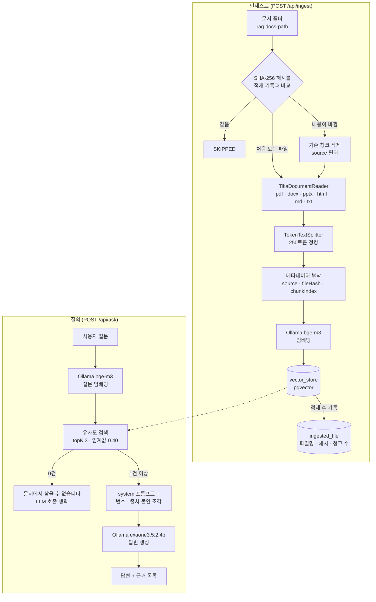
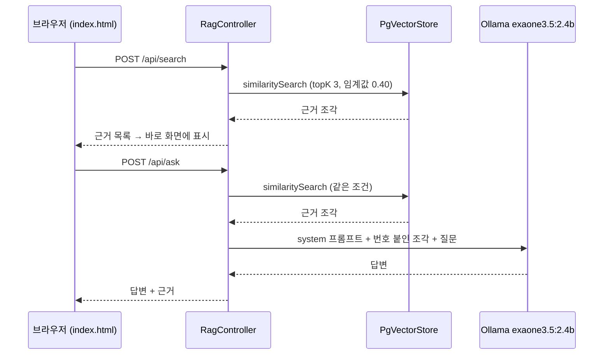

# 2차 개선 — 폴더 단위 적재 · 중복 방지 · 출처 표시 · 질의 화면

> [README](../README.md) · [1차 구현](1차_구현.md) · **2차 개선**

1차 구현은 "RAG가 동작한다"를 확인하는 데까지였습니다. 텍스트 파일 하나를 앱이 뜰 때마다 다시 넣었고, 답변만 돌려줄 뿐 무엇을 근거로 했는지는 보이지 않았습니다.

2차에서는 1차의 [앞으로 할 것](1차_구현.md#앞으로-할-것)에 적어 둔 항목 중 **PDF 지원, 중복 저장 방지, 출처 표시**를 구현하고, 브라우저에서 바로 질문할 수 있는 화면을 붙였습니다.

## 한눈에 보기

| 구분           | 1차                                      | 2차                                                                   |
| -------------- | ---------------------------------------- | --------------------------------------------------------------------- |
| 문서 입력      | classpath의 `sample.txt` 한 개           | 지정 폴더의 pdf·docx·pptx·html·md·txt 전체 (Tika)                     |
| 적재 시점      | 앱 실행마다 자동 (`ApplicationRunner`)   | `POST /api/ingest` 호출 시                                            |
| 중복 처리      | 실행할 때마다 같은 청크가 또 저장됨      | SHA-256 해시 비교로 새 파일·바뀐 파일만 적재                          |
| 청킹           | 200토큰 / 최소 100자 (코드에 고정)       | 250토큰 / 최소 120자 (`application.yml`로 분리)                       |
| 검색           | topK 3                                   | topK 3 + 유사도 임계값 0.40                                           |
| 근거 없는 질문 | LLM이 "찾을 수 없다"를 판단              | 임계값을 넘는 청크가 없으면 LLM을 부르지 않고 바로 응답               |
| 프롬프트       | user 메시지 하나에 지시 + 문서           | system(규칙) / user(번호·출처 붙인 조각 + 질문) 분리                  |
| 응답           | 답변 문자열                              | 답변 + 근거 목록(출처 파일, 점수, 발췌) JSON                          |
| API            | `GET /search`, `GET /ask`                | `/api/search`, `/api/ask`, `/api/ingest`, `/api/ingested`, `/api/config` |
| 화면           | 없음                                     | `static/index.html` 질의 화면                                         |
| 답변 모델      | `gemma2:9b`, temperature 0.3             | `exaone3.5:2.4b`, temperature 0.2, 출력 300토큰 제한                  |

## 목차

- [구조](#구조)
- [개선 내용](#개선-내용)
  1. [폴더 단위 문서 적재 (Tika)](#1-폴더-단위-문서-적재-tika)
  2. [중복 적재 방지](#2-중복-적재-방지)
  3. [한국어 문서에 맞춘 청킹](#3-한국어-문서에-맞춘-청킹)
  4. [출처 메타데이터](#4-출처-메타데이터)
  5. [검색 임계값과 '근거 없음' 처리](#5-검색-임계값과-근거-없음-처리)
  6. [프롬프트 분리](#6-프롬프트-분리)
  7. [API](#7-api)
  8. [질의 화면](#8-질의-화면)
  9. [답변 모델과 생성 옵션](#9-답변-모델과-생성-옵션)
- [설정값과 근거](#설정값과-근거)
- [트러블슈팅](#트러블슈팅)
- [실행 결과](#실행-결과)
- [배운 점](#배운-점)
- [앞으로 할 것](#앞으로-할-것)

---

## 구조

### 패키지 구조

1차에서는 모든 클래스가 루트 패키지에 있었는데, 역할에 따라 `api`(요청 처리)와 `ingest`(문서 적재)로 나눴습니다.

```
src/main/java/com/example/rag
├── RagApplication.java
├── api
│   └── RagController.java           # 검색 · 질의 · 적재 API
└── ingest
    ├── IngestService.java           # 폴더 스캔 → 청킹 → 임베딩 → 적재
    └── IngestedFileRepository.java  # 적재 기록 테이블 (ingested_file)

src/main/resources
├── application.yml
└── static/index.html                # 질의 화면
```

### 전체 구조



---

## 개선 내용

### 1. 폴더 단위 문서 적재 (Tika)

`spring-ai-tika-document-reader` 의존성을 추가하고 `TikaDocumentReader`로 문서를 읽습니다. Apache Tika는 파일 형식을 스스로 판별해 텍스트를 뽑아주기 때문에, PDF 전용 리더(`spring-ai-pdf-document-reader`) 대신 이쪽을 쓰면 **리더 하나로 PDF·Word·PowerPoint·HTML까지** 처리됩니다.

```gradle
implementation 'org.springframework.ai:spring-ai-tika-document-reader'
```

- `rag.docs-path` 폴더 **바로 아래의 파일만** 읽습니다. 하위 폴더는 읽지 않습니다.
- 확장자 목록(`pdf, doc, docx, ppt, pptx, html, htm, txt, md`)에 있는 파일만 대상으로 삼습니다.
- 텍스트를 뽑지 못한 파일(스캔 이미지로 된 PDF 등)은 `EMPTY`로 표시하고 건너뜁니다.

### 2. 중복 적재 방지

1차 [트러블슈팅 7번](1차_구현.md#7-중복-저장)(실행할 때마다 같은 문서가 다시 저장됨)에서 남은 과제로 남겨 둔 부분입니다.

어떤 파일을 어떤 내용으로 적재했는지 기록하는 테이블을 따로 둡니다. 앱이 뜰 때 `@PostConstruct`에서 없으면 만듭니다.

```sql
CREATE TABLE IF NOT EXISTS ingested_file (
    file_name   TEXT PRIMARY KEY,
    file_hash   TEXT NOT NULL,
    chunk_count INT  NOT NULL,
    ingested_at TIMESTAMPTZ NOT NULL DEFAULT now()
)
```

적재할 때마다 파일의 SHA-256 해시를 계산해 기록과 비교합니다.

| 상황                                  | 처리                                       | 결과 상태 |
| ------------------------------------- | ------------------------------------------ | --------- |
| 처음 보는 파일                        | 청킹 → 임베딩 → 적재, 기록 추가            | `ADDED`   |
| 파일명은 같고 해시가 다름 (내용 수정) | 기존 청크를 지우고 다시 적재, 기록 갱신    | `UPDATED` |
| 파일명과 해시가 모두 같음             | 아무것도 하지 않음                         | `SKIPPED` |
| 텍스트 추출 실패                      | 적재하지 않음                              | `EMPTY`   |

변경 여부는 수정 날짜가 아니라 **파일 내용의 해시**로 판단합니다. 수정 날짜는 파일을 복사하거나 다시 저장하기만 해도 내용과 상관없이 바뀌기 때문입니다.

기존 청크는 청크마다 붙여 둔 `source` 메타데이터로 걸러서 지웁니다.

```java
vectorStore.delete(new Filter.Expression(
        Filter.ExpressionType.EQ,
        new Filter.Key("source"),
        new Filter.Value(fileName)));
```

`POST /api/ingest?force=true`로 호출하면 해시가 같아도 전부 다시 적재합니다. 청킹 설정을 바꿔 가며 실험할 때 씁니다.

### 3. 한국어 문서에 맞춘 청킹

```java
TokenTextSplitter.builder()
        .withChunkSize(chunkSize)                 // rag.chunk-size (250)
        .withMinChunkSizeChars(minChunkSizeChars) // rag.min-chunk-size-chars (120)
        .withMinChunkLengthToEmbed(30)
        .build();
```

Spring AI 기본값(800토큰 / 최소 350자)은 한글 문서에는 너무 커서 **청크 하나에 여러 주제가 섞입니다.** 같은 질문("실행환경의 다섯 가지 서비스 그룹이 뭔가요?")으로 두 설정을 비교했습니다.

| 청크 크기        | 청크 수      | 1위 점수 | 정답 조각 순위 | 1위–2위 점수 차 |
| ---------------- | ------------ | -------- | -------------- | --------------- |
| 800토큰 (기본값) | 파일당 2개   | 0.49     | **3위**        | 0.019           |
| 250토큰          | 파일당 5~7개 | 0.68     | **1위**        | 0.156           |

800토큰에서는 조각마다 여러 주제가 섞여 **모든 조각이 질문과 고만고만하게 비슷했고**(1·2위 차이 0.019), 정답이 든 조각은 3위로 밀렸습니다. topK가 2 이하였다면 정답이 LLM에 전달되지도 않았을 상황입니다. 250토큰으로 줄이자 정답 조각이 0.68로 1위에 올랐고, 2위와의 차이도 0.156으로 벌어졌습니다.

30자보다 짧은 조각은 임베딩하지 않고 버립니다.

값은 `application.yml`로 빼서 코드 수정 없이 바꿀 수 있습니다. 바꾼 뒤에는 `?force=true`로 다시 적재해야 반영됩니다.

### 4. 출처 메타데이터

각 청크에 메타데이터 세 개를 붙입니다. Tika가 넣어 준 메타데이터는 그대로 두되, 이 세 키는 항상 덮어씁니다.

| 키           | 값                    | 쓰임                               |
| ------------ | --------------------- | ---------------------------------- |
| `source`     | 파일명                | 답변 근거 표시, 파일 단위 삭제     |
| `fileHash`   | 파일의 SHA-256        | 어느 버전의 파일에서 나온 청크인지 |
| `chunkIndex` | 파일 안에서의 순번    | 원문에서의 위치                    |

### 5. 검색 임계값과 '근거 없음' 처리

1차에서는 `topK(3)`만 지정해서, **어떤 질문이든 가장 가까운 청크(최대 3개)가 무조건 딸려왔습니다.** 문서와 상관없는 질문에도 LLM은 엉뚱한 문서를 받아 들고 "찾을 수 없다"를 스스로 판단해야 했습니다.

2차에서는 유사도 임계값을 걸었습니다.

```java
SearchRequest.builder()
        .query(question)
        .topK(topK)                               // rag.top-k (3)
        .similarityThreshold(similarityThreshold) // rag.similarity-threshold (0.40)
        .build();
```

임계값을 넘는 청크가 하나도 없으면 **LLM을 호출하지 않고** 바로 "문서에서 찾을 수 없습니다."를 돌려줍니다. 할루시네이션 방지를 프롬프트에만 맡기지 않고 검색 단계에서 먼저 거르는 셈이고, 수십 초 걸리는 답변 생성도 건너뜁니다.

**0.40이라는 값의 근거** — 문서와 관련된 질문과 무관한 질문을 나눠 검색 점수를 재 봤습니다.

| 질문 종류          | 검색 점수   |
| ------------------ | ----------- |
| 문서와 관련된 질문 | 0.47 ~ 0.68 |
| 문서와 무관한 질문 | 0.26 ~ 0.34 |

두 구간 사이에 비어 있는 0.34 ~ 0.47의 가운데인 **0.40**을 기준으로 잡았습니다. 관련 질문은 떨어뜨리지 않으면서 무관한 질문은 확실히 거르는 위치입니다.

**임계값과 프롬프트는 막는 대상이 다릅니다.**

| 질문 유형                      | 예                                 | 걸러지는 곳                                                   |
| ------------------------------ | ---------------------------------- | ------------------------------------------------------------- |
| 주제 자체가 문서와 무관        | "오늘 서울 날씨는 어때"            | 임계값 — 검색 결과 0건, LLM 호출 없음                         |
| 주제는 맞지만 답이 문서에 없음 | 문서가 다루는 주제의 다른 세부 사항 | 프롬프트 — "근거가 없을 때만 '찾을 수 없습니다'" 규칙          |

주제가 맞는 질문은 관련 조각이 임계값을 넘겨 검색되기 때문에 임계값으로는 걸러지지 않습니다. 그래서 임계값을 걸었다고 해서 프롬프트의 "근거가 없으면 없다고 답하라" 규칙을 뺄 수는 없고, **둘 다 필요합니다.**

### 6. 프롬프트 분리

규칙은 system 메시지로, 문서 조각과 질문은 user 메시지로 나눴습니다.

```text
아래 문서 조각을 근거로 질문에 한국어로 답하세요.

- 문서 조각에 있는 내용으로 답하고, 없는 내용은 지어내지 마세요.
- 문서에 쓰인 용어를 그대로 사용하세요.
- 목록을 묻는 질문이면 문서에 있는 항목을 빠짐없이 나열하세요.
- 답만 간결하게 쓰세요. 문서에 대한 설명, 사과, "문서에 따르면" 같은
  머리말은 붙이지 마세요.
- 어느 조각에도 근거가 없을 때만 "문서에서 찾을 수 없습니다"라고 답하세요.
```

이 프롬프트는 모델을 2.4b로 내린 뒤 한 번 고쳐 쓴 버전입니다. 이유는 [트러블슈팅 2번](#2-정답-조각을-받고도-찾을-수-없다고-답함)에 정리했습니다.

- **해야 할 일을 먼저** 씁니다. "문서 조각으로 답하라"가 맨 앞이고, "찾을 수 없습니다"는 **어느 조각에도 근거가 없을 때만** 쓰는 마지막 조건입니다.
- **머리말 금지**를 명시했습니다. "문서에 따르면" 같은 군더더기가 줄면 생성 토큰도 줄어 속도에도 도움이 됩니다.
- 답변에 `[1]` 같은 **인용 번호를 달라는 규칙은 뺐습니다.** 화면의 근거 이동 버튼과 역할이 겹치고, 규칙이 하나 줄면 작은 모델이 나머지 규칙을 지킬 여력이 늘어납니다.

user 메시지는 조각마다 번호와 출처를 붙여 조립합니다. 이 번호는 응답의 `sources[].index`와 같아서, 화면에서 답변과 근거를 이어 볼 수 있습니다.

```text
# 문서 조각
[1] 출처: 전자정부_표준프레임워크_개요.pdf
(청크 본문)

[2] 출처: ...

# 질문
(사용자 질문)
```

### 7. API

| 메서드 | 경로                        | 설명                                                                 |
| ------ | --------------------------- | -------------------------------------------------------------------- |
| POST   | `/api/ask`                  | 검색 + 답변 생성. 답변과 근거 목록을 함께 반환                       |
| POST   | `/api/search`               | 검색만 수행. 검색 품질을 눈으로 확인할 때 사용                       |
| POST   | `/api/ingest?force=false`   | 폴더를 훑어 새 파일·바뀐 파일만 적재. 파일별 결과(`status`) 반환     |
| GET    | `/api/ingested`             | 현재 적재된 파일 목록과 청크 수                                      |
| GET    | `/api/config`               | 화면 표시용 `topK`, `similarityThreshold`                            |

`/api/ask`, `/api/search`는 `{"question": "..."}` 형식의 JSON을 받습니다. 1차의 `GET ?q=` 방식과 달리 질문이 URL이 아니라 요청 본문에 실리므로, 한글이나 특수문자의 URL 인코딩을 신경 쓸 필요가 없습니다.

`/api/ask` 응답 예시:

```json
{
  "answer": "실행환경의 다섯 가지 서비스 그룹은 다음과 같습니다: ...",
  "sources": [
    {
      "index": 1,
      "source": "전자정부_표준프레임워크_개요.pdf",
      "score": 0.6839510202407837,
      "excerpt": "다섯 개의 서비스 그룹으로 나뉜다. · 화면처리 : 사용자 인터페이스와 요청 흐름을 담당한다. …"
    }
  ]
}
```

`excerpt`는 청크 앞부분 200자를 공백을 정리해 잘라 낸 것입니다.

### 8. 질의 화면

`src/main/resources/static/index.html` 한 파일에 HTML·CSS·JS를 모두 담았습니다. 별도 빌드 없이 앱을 띄우고 `http://localhost:8080`에 접속하면 됩니다.



- **두 단계 요청**: 검색은 금방 끝나고 답변 생성은 수십 초가 걸리기 때문에, `/api/search`로 근거를 먼저 보여 주고 이어서 `/api/ask`로 답변을 기다립니다. 기다리는 동안 경과 시간(초)을 표시합니다.
- **점수 막대**: 근거마다 유사도 점수를 막대로 그리고, 막대 위 세로선으로 임계값(0.40) 위치를 표시합니다. 기준선보다 얼마나 여유 있게 검색됐는지가 한눈에 보입니다.
- **근거 탐색**: 이전/다음 버튼이나 목록 클릭으로 근거를 하나씩 넘겨 봅니다. 처음에는 답변에 `[1]` 같은 인용 번호를 달게 했지만, 이 버튼과 역할이 겹쳐 프롬프트에서 뺐습니다. (답변에 `[n]` 표기가 있으면 화면이 여전히 해당 근거로 이동하는 버튼으로 바꿔 줍니다.)
- **문서 관리**: 적재된 파일과 조각 수를 보여 주고, "새 문서 읽기"(`/api/ingest`)와 "전체 다시 읽기"(`?force=true`) 버튼을 둡니다.
- 검색 결과가 0건이면 답변 요청을 보내지 않고 "기준 점수를 넘는 문서 조각이 없습니다" 안내를 띄웁니다. 답변이 "찾을 수 없습니다"이면 답변 왼쪽 선을 빨간색으로 바꿔 구분합니다.
- `Ctrl+Enter`로도 질문을 보낼 수 있습니다.

### 9. 답변 모델과 생성 옵션

```yaml
spring:
  ai:
    ollama:
      chat:
        options:
          model: exaone3.5:2.4b
          temperature: 0.2
          num-predict: 300
          num-ctx: 4096
```

#### 왜 exaone3.5:2.4b로 내렸나

2.4b로 바꾸기 직전에는 `exaone3.5:7.8b`로 답변을 생성했는데, **질문 하나에 답이 나오기까지 약 2분 30초**가 걸렸습니다. 화면을 띄워 놓고 쓰기에는 너무 길어서, 파라미터 수가 약 3분의 1인 `exaone3.5:2.4b`(약 1.6GB)로 내리고 생성 옵션을 함께 조정했습니다.

작은 모델로 내리면 품질이 떨어질 수 있다는 우려가 있었고, 실제로 속도는 빨라졌지만 **정답 조각을 받고도 "찾을 수 없습니다"라고 답하는 문제**가 생겼습니다([트러블슈팅 2번](#2-정답-조각을-받고도-찾을-수-없다고-답함)).

판단 기준은 이렇게 잡았습니다.

> 조금 느리더라도, **정답이 든 문서를 앞에 두고 못 찾는 모델은 쓸 수 없다.** RAG에서 가장 나쁜 실패다.

그래서 프롬프트를 고쳐도 품질이 돌아오지 않으면 7.8b로 되돌리기로 하고, 먼저 프롬프트와 옵션을 손봤습니다. 품질이 회복되어 2.4b를 유지했습니다.

| 모델             | 상태                         | 답변 시간          | 품질                                   |
| ---------------- | ---------------------------- | ------------------ | -------------------------------------- |
| `exaone3.5:7.8b` | 생성 옵션 조정 전            | 약 2분 30초        | 정상                                   |
| `exaone3.5:2.4b` | 프롬프트 수정 전             | 빨라짐             | 정답 조각을 두고 "찾을 수 없습니다"    |
| `exaone3.5:2.4b` | 프롬프트 수정 + 옵션 조정 후 | 약 20초 (첫 요청)  | 정상                                   |

#### 생성 옵션

| 옵션          | 값               | 이유                                                                                                                                                             |
| ------------- | ---------------- | ---------------------------------------------------------------------------------------------------------------------------------------------------------------- |
| `model`       | `exaone3.5:2.4b` | 위 참고. LG AI연구원 EXAONE 3.5의 2.4B 모델                                                                                                                      |
| `temperature` | 0.2              | 문서 기반 응답에는 창의성이 필요 없습니다. Ollama 기본값(0.8)이면 같은 질문에도 답이 흔들리고, 낮추면 문서의 표현을 그대로 쓰는 쪽으로 붙습니다. 1차의 0.3보다 더 낮췄습니다 |
| `num-predict` | 300              | 한 번에 생성하는 최대 토큰 수. 답변 길이와 생성 시간에 상한을 둡니다                                                                                             |
| `num-ctx`     | 4096             | 모델이 한 번에 다루는 컨텍스트 크기. 이 값이 좁으면 프롬프트 앞부분이 **에러 없이 잘려 나갈 수 있고**, 그러면 앞쪽에 있는 문서 조각이 통째로 사라집니다. 넉넉히 명시했습니다 |

> **라이선스 주의**: EXAONE 3.5는 2.4b도 7.8b와 같은 연구/비상업 목적 라이선스입니다. 상업적으로 쓰려면 답변 모델을 다시 골라야 합니다. 설정 파일에서 모델명 한 줄만 바꾸면 교체됩니다.

---

## 설정값과 근거

```yaml
rag:                           # spring: 과 같은 최상위 높이 (options: 안에 넣으면 안 됨)
  docs-path: D:/dev/rag-docs   # 적재할 문서 폴더 (각자 환경에 맞게 변경)
  top-k: 3                     # 검색할 청크 수
  similarity-threshold: 0.40   # 이 점수 미만 청크는 근거에서 제외
  chunk-size: 250              # 청크 크기 (토큰)
  min-chunk-size-chars: 120    # 청크 최소 글자 수
```

튜닝한 값은 모두 측정한 숫자를 근거로 정했습니다.

| 값                           | 근거                                                                                                            |
| ---------------------------- | --------------------------------------------------------------------------------------------------------------- |
| `chunk-size: 250`            | 800토큰(기본값)에서는 정답 조각이 3위(1·2위 차 0.019). 250토큰에서 1위 0.68(차 0.156) → [3번](#3-한국어-문서에-맞춘-청킹) |
| `similarity-threshold: 0.40` | 관련 질문 0.47~0.68, 무관한 질문 0.26~0.34 사이 빈 구간의 가운데 → [5번](#5-검색-임계값과-근거-없음-처리)          |
| `top-k: 3`                   | 코드 기본값 5에서 줄임. 같은 이름의 Ollama 옵션과 혼동 주의 → [트러블슈팅 3번](#3-이름이-같은-두-개의-top-k)       |
| `exaone3.5:2.4b`             | 7.8b 약 2분 30초 → 약 20초. 품질은 프롬프트 수정으로 회복 → [9번](#9-답변-모델과-생성-옵션)                        |
| `temperature: 0.2`           | 문서에 붙은 답, 같은 질문에 흔들리지 않는 답                                                                    |
| `num-ctx: 4096`              | 컨텍스트가 좁으면 문서 조각이 조용히 잘려 나갈 수 있음                                                          |
| `num-predict: 300`           | 답변 길이와 생성 시간의 상한                                                                                    |

---

## 트러블슈팅

| #   | 문제                                                                               | 한 줄 요약                                         |
| --- | ---------------------------------------------------------------------------------- | -------------------------------------------------- |
| 1   | [답변 한 번에 2분 30초](#1-답변-한-번에-2분-30초)                                   | 2.4b로 교체 + 출력 상한으로 약 20초                |
| 2   | [정답 조각을 받고도 찾을 수 없다고 답함](#2-정답-조각을-받고도-찾을-수-없다고-답함) | 프롬프트 순서·규칙 수 조정 + 컨텍스트 크기 명시    |
| 3   | [이름이 같은 두 개의 top-k](#3-이름이-같은-두-개의-top-k)                           | 검색 설정(`rag.top-k`)과 Ollama 옵션을 구분        |

### 1. 답변 한 번에 2분 30초

**증상**: `exaone3.5:7.8b`로 답변을 만들 때 질문 하나에 약 2분 30초가 걸렸습니다.

**원인**: 7.8B 모델로 답변을 생성하는 시간 자체가 길었고, 출력 길이 상한(`num-predict`)도 두지 않은 상태였습니다.

**해결**: 모델을 `exaone3.5:2.4b`로 내리고 `num-predict: 300`으로 출력 길이에 상한을 뒀습니다. 이후 프롬프트에서 머리말을 없애 생성하는 토큰을 더 줄였습니다. 최종 설정에서는 첫 요청 기준 약 20초가 걸립니다.

**배운 점**: 응답 속도는 모델 크기뿐 아니라 **생성하는 토큰 수**에도 달려 있습니다. 출력 상한(`num-predict`)과 군더더기 없는 프롬프트도 속도 설정입니다.

### 2. 정답 조각을 받고도 찾을 수 없다고 답함

**증상**: 2.4b로 바꾼 뒤 속도는 빨라졌지만, 정답이 든 조각(점수 0.684)이 검색되는 질문에도 모델이 "문서에서 찾을 수 없습니다"라고 답했습니다. 답이 나오는 경우에도 본론 앞에 "제시되지 않았습니다", "문서에서 제공된 정보에 따르면", "따라서 답변은 다음과 같습니다" 같은 군더더기가 길게 붙었습니다.

**원인 점검**: 세 가지를 의심했습니다.

1. **`top-k` 설정 위치** — [3번](#3-이름이-같은-두-개의-top-k) 참고
2. **프롬프트 구조** — 당시 프롬프트는 금지 조항 위주였고, 두 번째 항목부터 "없으면 없다고 답하라"가 나왔습니다. 작은 모델은 이 지시를 가장 먼저 집어 들어 "확실하지 않으면 없다고 하자"로 기울기 쉽습니다. 답변에 `[1]` 같은 인용 번호를 달라는 규칙까지 있어서 지킬 규칙도 많았습니다.
3. **컨텍스트 길이** — Ollama의 컨텍스트(`num-ctx`)가 좁으면 프롬프트 앞부분이 에러 없이 잘려 나갈 수 있습니다. 앞쪽의 문서 조각이 잘리면 모델 입장에서는 정말로 근거가 없습니다.

**해결**: 프롬프트를 다시 쓰고 생성 옵션을 함께 조정했습니다.

- "문서 조각으로 답하라"를 맨 앞에 두고, "찾을 수 없습니다"는 **어느 조각에도 근거가 없을 때만** 쓰는 마지막 조건으로 옮겼습니다.
- 인용 번호 규칙을 뺐습니다. 화면의 근거 이동 버튼이 같은 역할을 합니다.
- "문서에 따르면" 같은 머리말을 붙이지 말라고 명시했습니다.
- `temperature: 0.2`, `num-ctx: 4096`, `num-predict: 300`을 설정했습니다.

바꾼 뒤 같은 질문 세 개를 다시 던졌을 때 모두 제대로 답했고, 답변 시간도 많이 줄었습니다. 다만 프롬프트와 옵션을 한꺼번에 바꿨기 때문에, 둘 중 어느 쪽이 결정적이었는지는 따로 나눠 확인하지 않았습니다.

**배운 점**:

- 작은 모델일수록 **프롬프트의 순서와 규칙 수**에 민감합니다. 금지 조항을 나열하기보다 해야 할 일을 먼저 쓰고, 예외 조건은 뒤로 미는 편이 낫습니다.
- 규칙을 하나 덜어내면 작은 모델이 나머지 규칙을 지킬 여력이 늘어납니다.
- 모델을 줄일 때는 속도만 보면 안 됩니다. **정답이 있는 질문과 없는 질문을 둘 다** 다시 돌려 봐야 품질 저하를 잡을 수 있습니다.

### 3. 이름이 같은 두 개의 top-k

**상황**: 검색 조각 수를 3개로 줄이던 중에 2번 문제가 생겨, 원인 후보로 가장 먼저 이 설정의 위치를 확인했습니다. `top-k`는 두 군데에 같은 이름으로 존재합니다.

| 설정                                   | 의미                                                        |
| -------------------------------------- | ----------------------------------------------------------- |
| `rag.top-k`                            | 벡터 검색으로 가져올 문서 조각 수 (이 프로젝트에서 만든 값) |
| `spring.ai.ollama.chat.options.top-k`  | LLM이 다음 토큰을 고를 때 보는 후보 수 (Ollama 샘플링 옵션) |

`model`, `num-predict`와 나란히 `options:` 아래에 `top-k: 3`을 적으면 Ollama 쪽 설정이 됩니다. 그러면 **에러는 전혀 나지 않고**, 검색은 코드 기본값대로 5개를 가져오면서 모델만 매 토큰 상위 3개 후보 중에서 고르게 됩니다. 의도와 완전히 다른 동작입니다.

**확인**: `rag:` 블록은 `spring:`과 같은 최상위 높이에 있어야 합니다.

```yaml
spring:
  ai:
    ollama:
      chat:
        options:          # ← 여기는 Ollama(LLM) 옵션
          model: exaone3.5:2.4b
          num-predict: 300

rag:                      # ← spring: 과 같은 높이
  top-k: 3                # ← 검색 조각 수
```

적용 여부는 화면의 "근거 N건"이 3건 이하로 나오는지, 또는 `GET /api/config`의 `topK` 값으로 바로 확인할 수 있습니다.

**배운 점**: 같은 이름이라도 **어느 계층에 있느냐**에 따라 전혀 다른 설정이 됩니다. 설정 실수는 에러 없이 조용히 동작만 바꾸기 때문에, 바꾼 값이 실제로 적용됐는지 결과로 확인해야 합니다.

---

## 실행 결과

전자정부 표준프레임워크 관련 PDF 3개를 적재한 상태에서 확인했습니다. 실행 방법은 [README](../README.md#실행-방법)에 있습니다.

### 1. 적재 목록 — `GET /api/ingested`

| 파일                               | 청크 수 |
| ---------------------------------- | ------- |
| 개발환경_설치_가이드.pdf           | 5       |
| 공통컴포넌트_활용_가이드.pdf       | 5       |
| 전자정부_표준프레임워크_개요.pdf   | 7       |

### 2. 다시 적재해도 중복되지 않음 — `POST /api/ingest`

```json
[
  {"fileName":"개발환경_설치_가이드.pdf","status":"SKIPPED","chunkCount":0},
  {"fileName":"공통컴포넌트_활용_가이드.pdf","status":"SKIPPED","chunkCount":0},
  {"fileName":"전자정부_표준프레임워크_개요.pdf","status":"SKIPPED","chunkCount":0}
]
```

```bash
docker exec rag-postgres psql -U raguser -d ragdb -tAc \
  "SELECT metadata->>'source', count(*) FROM vector_store GROUP BY 1;"
```

```
공통컴포넌트_활용_가이드.pdf|5
전자정부_표준프레임워크_개요.pdf|7
개발환경_설치_가이드.pdf|5
```

내용이 그대로인 파일은 모두 건너뛰었고, DB의 청크 수도 적재 목록과 같은 17개 그대로입니다. 1차에서 앱을 켤 때마다 청크가 불어나던 문제가 해결됐습니다.

### 3. 문서에 있는 질문 — `POST /api/ask`

```json
{"question": "실행환경의 다섯 가지 서비스 그룹이 뭔가요?"}
```

```
실행환경의 다섯 가지 서비스 그룹은 다음과 같습니다:

1. 화면처리
2. 업무처리
3. 데이터처리
4. 연계통합
5. 공통기반
```

| 근거 | 출처                               | 점수  |
| ---- | ---------------------------------- | ----- |
| 1    | 전자정부_표준프레임워크_개요.pdf   | 0.684 |
| 2    | 전자정부_표준프레임워크_개요.pdf   | 0.528 |
| 3    | 전자정부_표준프레임워크_개요.pdf   | 0.515 |

1번 근거가 "다섯 개의 서비스 그룹으로 나뉜다. · 화면처리 : …"로 시작하는 청크이고, 답변의 다섯 항목이 모두 여기에 있습니다. 첫 요청 기준으로 답변까지 약 20초가 걸렸습니다(`exaone3.5:7.8b`에서는 약 2분 30초). 답변 앞에 "문서에 따르면" 같은 머리말도 붙지 않았습니다.

### 4. 문서에 없는 질문 — `POST /api/ask`

```json
{"question": "오늘 서울 날씨는 어때"}
```

```json
{"answer": "문서에서 찾을 수 없습니다.", "sources": []}
```

임계값 0.40을 넘는 청크가 하나도 없어 **LLM을 호출하지 않고 즉시** 응답했습니다. 1차에서는 임계값이 없어 같은 질문에도 가장 가까운 청크가 그대로 LLM에 전달됐습니다.

---

## 배운 점

**튜닝 값에는 근거가 있어야 합니다.** 청크 크기 250과 임계값 0.40은 감으로 고른 값이 아니라 점수를 재서 정했습니다. 코드는 누구나 비슷하게 쓸 수 있지만, "왜 이 값인가"에 숫자로 답할 수 있는지는 다른 문제입니다.

**검색 품질은 순위뿐 아니라 격차로 봐야 합니다.** 800토큰 청크에서도 정답 조각은 검색 결과 안에 있었습니다. 하지만 1·2위 차이가 0.019밖에 나지 않아 어떤 조각이 올라올지 사실상 운이었습니다. 정답이 **분명하게** 1위로 올라와야 안정적인 검색입니다.

**임계값과 프롬프트는 서로를 대신하지 못합니다.** 임계값은 주제가 다른 질문을, 프롬프트는 주제는 맞지만 답이 없는 질문을 막습니다.

**모델 선택은 속도와 품질을 같이 봐야 합니다.** 작은 모델은 빠르지만 프롬프트에 더 민감합니다. 모델을 내리면서 생긴 품질 문제는 모델 탓만이 아니라 프롬프트 구조 문제이기도 했고, 프롬프트를 고쳐 속도와 품질을 둘 다 얻었습니다.

---

## 앞으로 할 것

### 기능

- [x] PDF 문서 지원 → Tika로 pdf·docx·pptx·html·md·txt까지 지원
- [ ] 전자정부 표준프레임워크 공식 문서를 대상 데이터로 적용
- [x] 중복 저장 방지 (문서 해시 기반 체크) → SHA-256 + `ingested_file` 테이블로 구현
- [x] 답변에 출처(어떤 문서의 어느 부분인지) 표시 → 파일명·점수·발췌 반환
- [ ] 문서 업로드 API

### 프론트엔드

- [ ] React / Next.js 기반 채팅 UI (2차에서는 정적 HTML 한 장으로 질의 화면 구현)
- [ ] 스트리밍 응답 (토큰 단위 출력) — 총 시간은 그대로여도 글자가 바로 나오기 시작해 체감이 크게 달라짐. 서버에 SSE를 붙이고 화면에서 받아 표시
- [x] 검색된 청크를 함께 표시 → 질의 화면의 근거 목록과 점수 막대

### 인프라

- [ ] 배포 (접속 가능한 데모 링크 제공) — 로컬 LLM은 무료 티어에 올리기 어려워 방식을 정해야 함. 후보:
  - 배포용 프로필에서만 LLM을 외부 API로 교체 (Spring AI 덕분에 yml만 바꾸면 됨)
  - 개인 노트북을 서버로 두고 터널링
  - 데모 영상 + README로 대체
  - 어느 쪽이든 pgvector를 쓸 수 있는 관리형 PostgreSQL도 함께 정해야 함
- [ ] 청크 크기와 `topK` 값에 따른 검색 품질 비교 실험 (청크 크기 800 vs 250 비교는 완료 → [3번](#3-한국어-문서에-맞춘-청킹), `topK` 비교는 남음)
